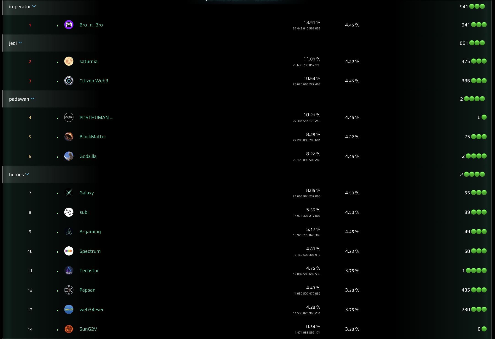
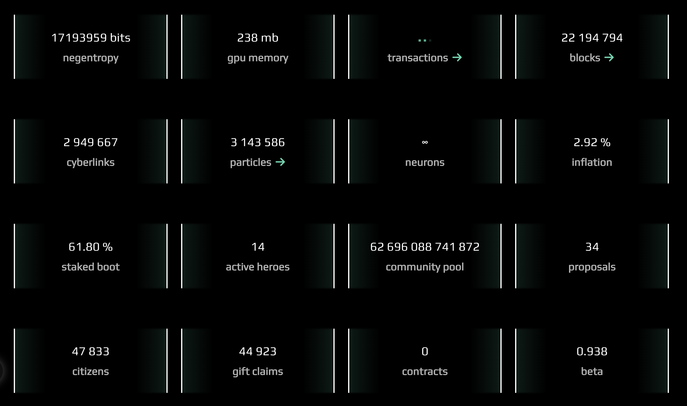

tags:: mt
alias:: 2025 year

- dear heroes and neurons!
- its was extremely hard, but i think the most important year for the project
- although the [[$BOOT]] lost its value almost tenfold we got something more important:
- > clarity
- i truly believe it was the year of clearance, and we cleared
	- everything what bloated our [[focus]] and,
	- everyone who did not truly believe in the idea we pace
- for the rest i am reminding our mission
- > create superintellgence of the planet
- that is, we need to spawn something that is smart then all human, robots, agents, animals, insects and mycelium combined
- i want to thank the group of validators who are still running the network, you are my [[heroes]]. without you the project would be dead.
- ## the heroes
- 
- [[bronbro]], [[saturnia]], [[citizen web3]], [[posthuman]], [[blackmatter]], [[godzilla]], [[galaxy]], [[subi]], [[a-gaming]], [[spectrum]], [[techstur]], [[papsan]], [[web34ever]], [[sung2v]]
- i also thankful to people who still submit [[cyberlinks]] even in the presence of fact that the feature is not working on [[cyb.ai]]. you also my heroes!
- i don't know most of you, but i know that we are somehow connected in a [[cyberspace]].
- I can feel clearly now that there is someone except me who feel responsible for holding something very unique and important for the future of humanity.
- I hope we will remember with smile the time when the project was headed by the a stupid church that didn't understand the power of the [[cybergraph]]
- Now i know that you know that we know.
- ## the model
- 
- Still there is nothing on the market even close to the [[bostrom]] and [[spacepussy]]
- > dynamic cryptographic multimodal model representing collective focus
- Its still small, and not so smart, because the collective was not
- but no doubt it is the future of ai, [[collective intelligence]] and [[superintelligence]]
-
- I promise, with time we get stronger, and stronger, and stronger...
-
- ## results
	- although the year marked by only 1 important event its really important and foundational: the upgrade that fixed
		- result of reactor explosion
		- broken economics and
		- finalized distribution
	- as result [[cybercongress]] in the present form have been eliminated. its mission is finished. Its time to step in for community.
- ## plans
	- ## product development
		- focus on demand for [[$A]] and [[$V]]
	- ## research on learning
		- we need to understand better [[what to learn]]
	- ## inference
		- from strict search to answers from a blockchain
	- ## privacy and incentives
		- last year i already did a significant part of the research needed to achieve the goal. although i did not published anything yet, i think 80% of a task is done. what remains is other 80%. this year with got [[nockvm]] supercharged by [[zk pow]]. also a lot of interesting stuff appeared from scalability of [[shapely value]] front. the design of [[tri-kernel]] is targeted on a local first computation towards [[collective focus]]. that opens the door for using mentioned above innovations for incremental computation of the weights. the deal is that we can move the approach from 10^9 links described by [[cft]] to a 10^21 which is the [[earth mycelium]] scale.
	- [[focus flow computation]] exploration
	- [[tri-kernel]] specification: extend diffusion with heat with springs and heat
	- [[cyberia]] establishment
	- physical gatherings, aka [[burn.city]]
-
- I want to invite you to join to the genesis.
-
-
-
- [[@mastercyb]]