- > the art of designing living systems in resonance with nature’s intelligence—not against it
- part of [[pirates of cyber states]] course on off grid living in [[cyberia]]
- ## purpose
  collapsed:: true
	- topic is huge
	- give a taste and inspire
- ## background
  collapsed:: true
	- research
		- 200 local [[species]]
		- [[soil]] research
		- [[birds research]]
		- [[water research]]
	- edem: 500 species => 400 survive => 200 can grow => 100 productive
		- 
	- animals: 10 sheep => 3 sheep => 5 sheep
		- 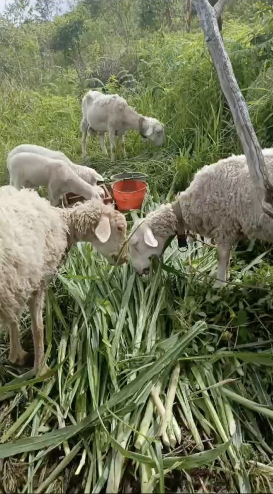
		- 
		- 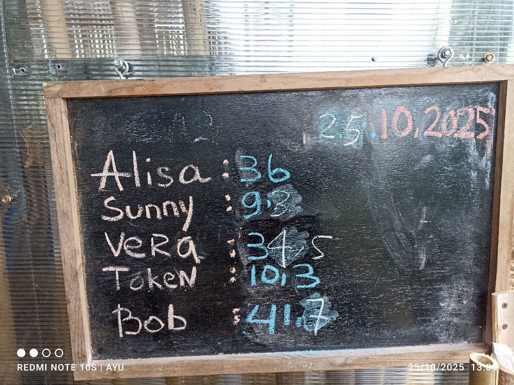
	- chickens: mostly eaten by predators
		- 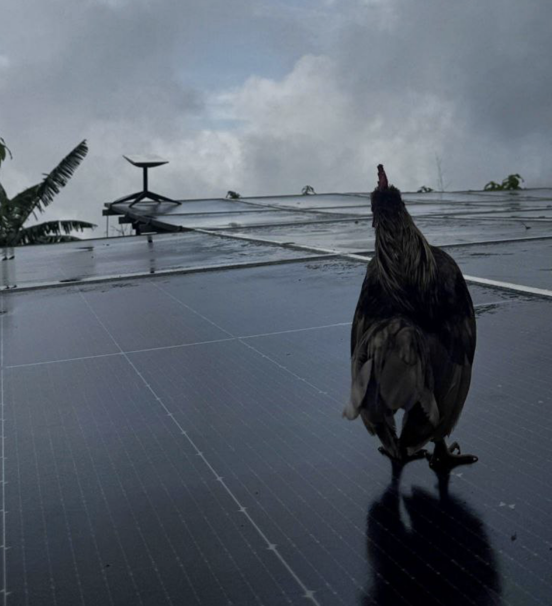
		- 
	- 7 ha coffee plantation results
		- 2 tones of coffee
		- continuous avocado, taro, batat, fern, chayote
		- banana and jackfruit under recovery
		- greens, salads, aromatics teas
		- foodbox (with the help of neighbors)
			- 
			- 
			- 
- ## school of thoughts
  collapsed:: true
	- what is biome engineering?
	- permaculture
	- horticulture
	- agroforestry
	- regenerative farming
	- syntropic growing
	- [[sytech]]
- ## one big difference
  collapsed:: true
	- one output => many outputs
	- many inputs => almost zero inputs
	- 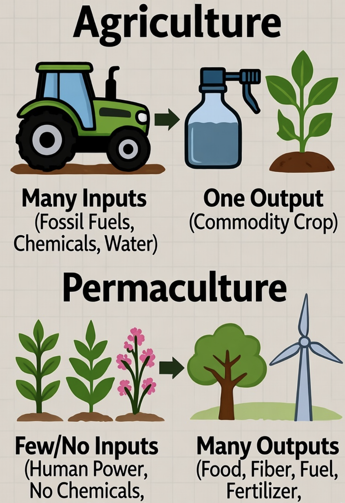{:height 966, :width 659}
- ## low margin => high margin
  collapsed:: true
	- $0.8 per kg
	  collapsed:: true
		- 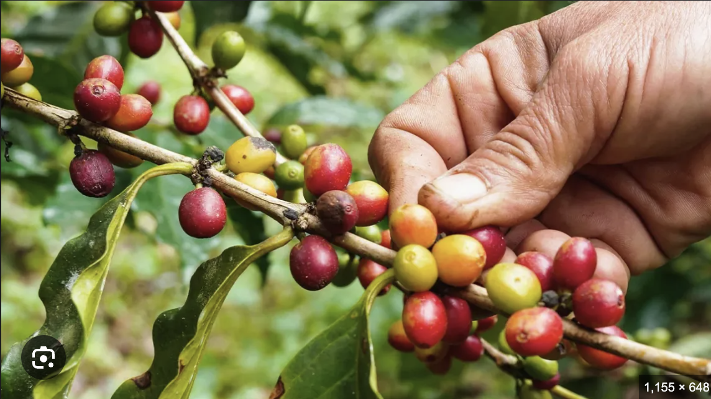
	- $500 per kg
	  collapsed:: true
		- 
	- $0.7 per kg
	  collapsed:: true
		- 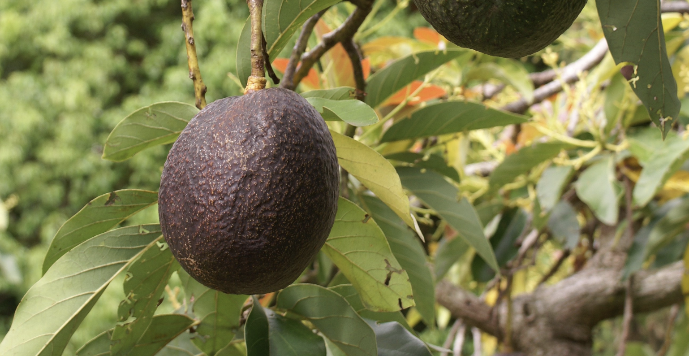
	- $50 per kg
	  collapsed:: true
		- 
	- sell raw => sell menu
	- 2x margin on real estate investments
		- higher utilization
		- better vibe
		- higher retention
	- 8% per year => 16% per year
- ## how to?
  collapsed:: true
	- aqua + fungi + plant + animals
		- 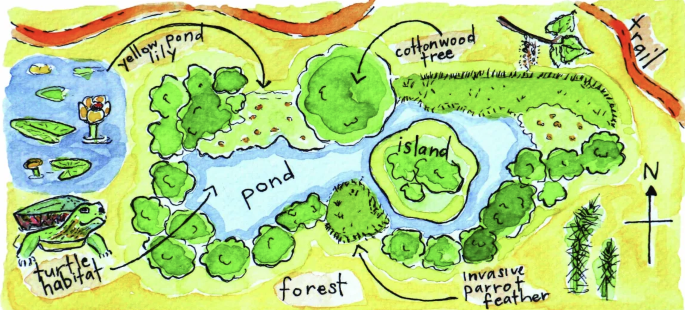
		- 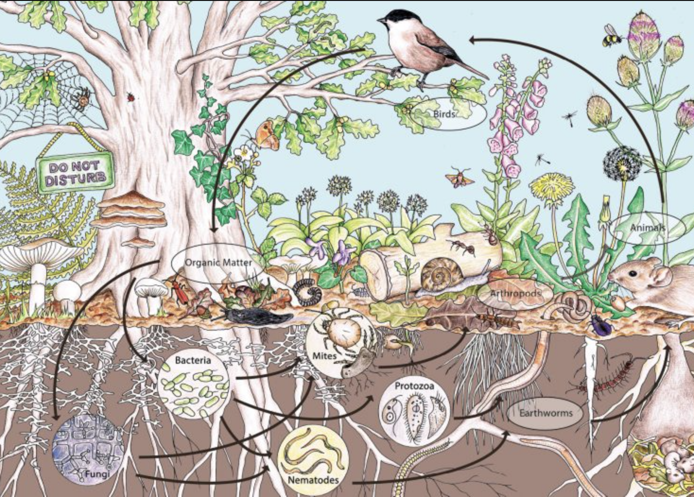
	- [[biochar]]
	- [[no dig]]
	  collapsed:: true
		- 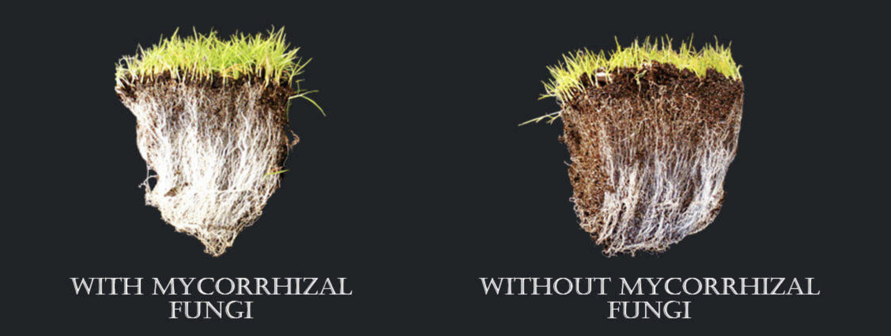
		- 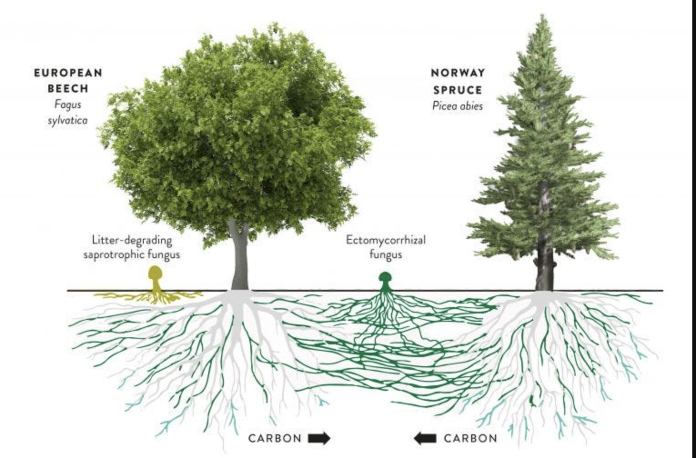
		- 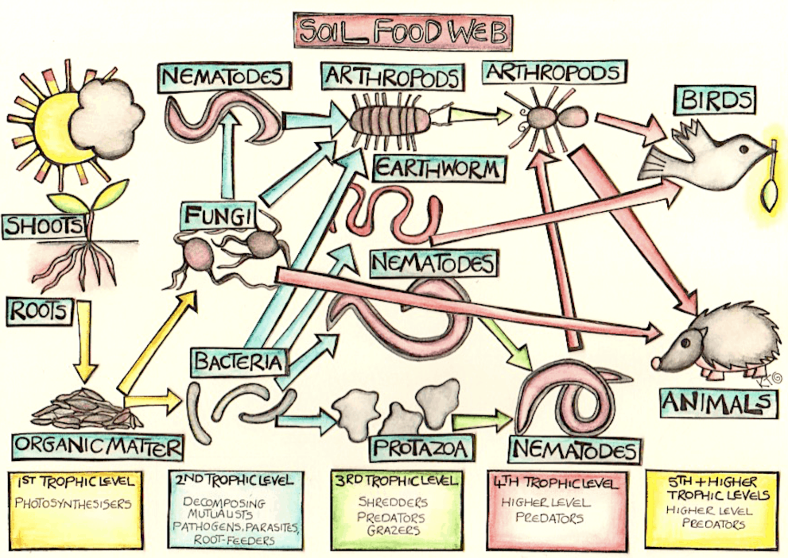
	- [[pruning]]
	- [[layers]]
		- 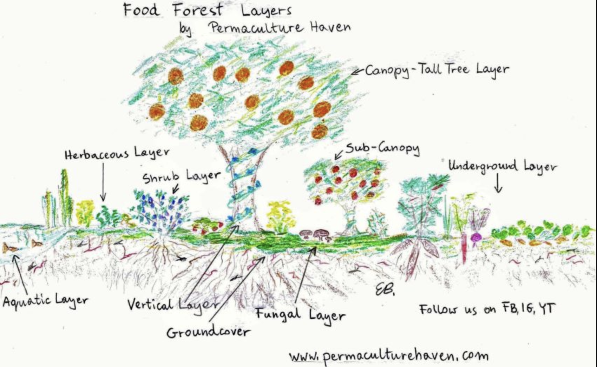
	- [[stratification]]
		- 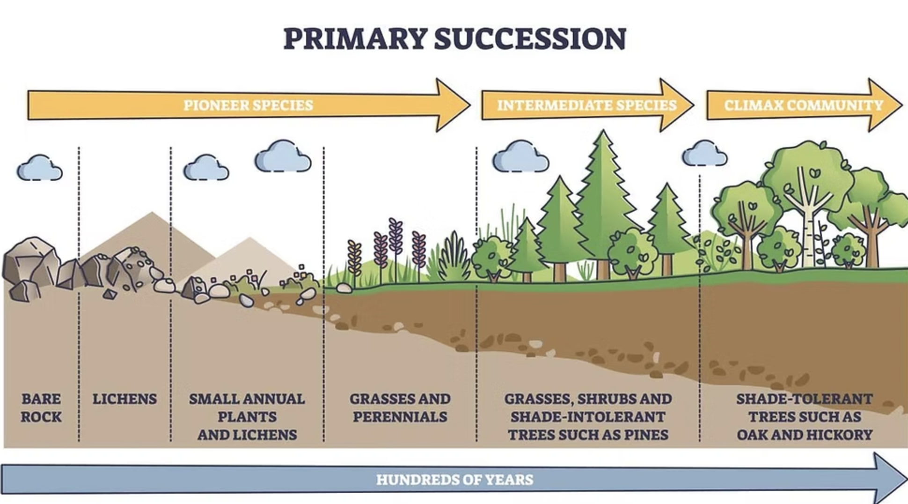
	- [[plant/features]]
	  collapsed:: true
		- [[nitrogener]]
		- [[accumulator]]
		- [[attractor]]
		- [[guard]]
- ## how to scale?
  collapsed:: true
	- 1*1 m grid
	- strict schedule
	- data mining
	- 
- ## Summary
  collapsed:: true
	- 1 primitive family (4 people) needs
	- 30 ares in tropics and subtropics
	- 1 ha in regions with winter
	- 3 years to setup
- ## Advices
  collapsed:: true
	- grow whats already growing => adapt
	- one small step at a time
- # Connect
	- ## t.me/cybervalleyland
		- _1761668766957_0.svg)
	- ## x.com/@mastercyb
		- _1761668827066_0.svg)
- old notes
  collapsed:: true
	- Biome engeneering is the art of designing living systems in resonance with nature’s intelligence—not against it. Rooted in the [[philosophy of harmonious complexity]] it assumes that life does not thrive through control, but through coherence — where every element, human and non-human, contributes to a whole. The aim is not to dominate the earth, but to inhabit it wisely.
	- At the same time, biome engineering is an emerging interdisciplinary field that blends ecology, technology, anthropology, and design. It focuses on modifying and optimizing ecosystems to meet human needs, restore natural balance, and cultivate self-sufficient environments. It treats life systems not as chaotic wilderness nor as exploitable machinery, but as intelligent, self-organizing structures that can be observed, guided, and co-created.
	- We begin with structure. Land is read through [[maps]], which divide territory across nested spatial scales:
		- [[sector]] is the smallest operative unit—defined by forms like [[bed]], [[wall]], and [[path]]
		- [[block]] is a homestead — enough to sustain a [[family]]
		- [[district]] is a shared commons — supporting a [[clan]] through social, hydrological, and economic integration
		- [[region]] hosts a [[tribe]]—a complete biome cell with cultural and ecological sovereignty
	- This division isn't arbitrary. It's grounded in the surface area a human needs to meet their basic food, material, and waste cycle needs — amplified through collaboration and layered design.
	- Within these maps, [[zones]] optimize activity: what’s closest is used most. [[shapes]] — like terraces or ponds —sculpt terrain for energy flow. [[patterns]] embed natural logic: branches distribute, spirals expand, pulses regulate.
	- Life is not flat. Vertical [[layers]] — from [[canopy]] to [[mycelium]] — allow multiple species to coexist in the same space. Through [[succession]], we understand how ecosystems change in time — from [[pioneers]] to [[climax]] species. [[stratification]] is the fusion: a structural view that connects time and space as one living continuum.
	- A healthy biome is not a monoculture. it is a [[guild]]: a polyculture of mutualists where each species supports the others. [[plant/features]] reveal their roles: builders, accumulators, protectors, attractors, and decomposers.
	- To guide this complexity, biome engineers use a simple set of [[methods]]:
		- [[observation]]: perceive rhythm, structure, and signal
		- [[formation]] prepares the land—groundwork for water, light, and structure
		- [[propagate plants]] initiate new life
		- [[harvesting]] return and redirect energy
		- [[support]] maintain and adapt to living conditions
	- These actions follow the [[lifecycle]]: germination, growth, reproduction, decline, and decay. Every method is a dance with timing. We don’t impose control—we enter rhythm.
	- [[climate]] sets the canvas. But [[microclimate]] draws the lines: the slope behind the wall, the shade under a tree, the breeze by the pond. This is where life truly negotiates space.
	- Biome engineers classify species by their [[plant/type]] and the [[products]] they yield: food, fuel, fodder, fiber, medicine, aroma, soil, and structure. But classification runs deeper: we ask what role it plays, what cycle it joins, and what relationships it forges.
	- a system is not alive because it grows. it is alive because it holds itself together. the purpose of biome engineering is not production—it is integration. a truly intelligent biome is one where every part multiplies the wholeness of every other part.
	- This is not farming. This is not agriculture. This is not landscaping
	- This is how life builds itself — through us, with us, as us. As part of the planetary mind.
-