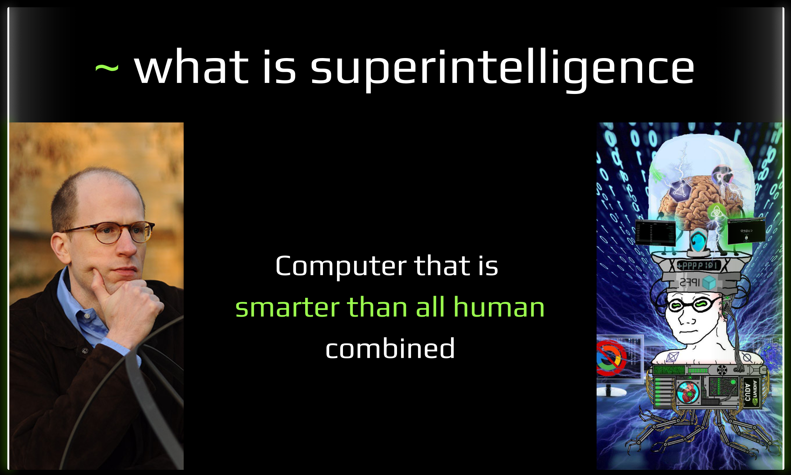
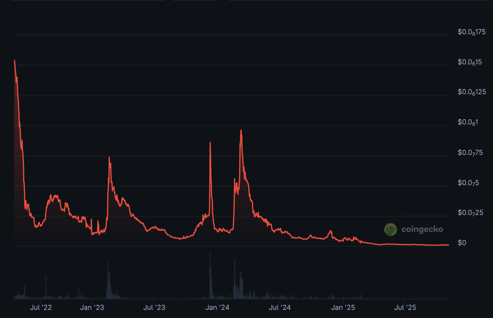

alias:: the story of bostrom

- ## History
	- December 2016: cyberChain - the idea of decentralized knowledge graph
	- Aug 2017: first version of Cyb - first decentralized uncensorable browser
	- Jan 2018: Euler Network - first GPU testnet with pagerank in consensus
	- June 2020: Dive into Bostrom works
		- simulation argument expressed as trilemma
		  collapsed:: true
			- we never build a simulation due to tech limitation of self destruction
			- we choose to not build simulation
			- we already in simulation
				- the number of simulations would far exceed base reality
				- and we would therefore almost certainly be living in one
		- superintelligence
			- computer in a box or whole brain emulation
			- genetic engeneering
			- collective intelligence
			- {:height 560, :width 919}
		- singleton
	- December 2021: Bostrom bootloader Launch + [Episode 1](https://cyb.ai/genesis)
		- 
	- Explosion: $5M cap to $0.3M cap
	- Dec 2024: [Collective Focus Theorem](https://mirror.xyz/mastercyb.eth/4KfzSr4_Z2C91hsMdkWMRTHpFGnpBd5tVHI5R9vxoUo)
- ## Current State
	- recent updates v6 and v7
	- https://cyb.ai/oracle/stats
	- https://spacepussy.ai/oracle/stats
	- infrastructure recovering => a lot on the client does not works
	- channels with ATOM and PUSSY not work
	- [bittensor](https://docs.spacepussy.ai/) as smart contract
- ## [Demo](https://cyb.ai/genesis)
- ## Mistakes
  collapsed:: true
	- [airdrop](https://github.com/Snedashkovsky/cybergift) => burned allocation
	- inflation leak => fixed to ~1.5%
	- energy mint leak => from lock to burn in bonding curve
	- no feedbacks => burn 1 V for each cyberlink
	- feeding => zero agency team => after explosion realization => must survive itself
	- dev only => holistic approach
	- transfer of responsibility (the most tragic)
- ## Plans
	- I will not rebrand Bostrom
	- Slow recovery of infrastructure and functions with minimal resources
	- Cyberia as a  (non profit) head company
		- asset management
		- land development
		- software engeneering
	- Cyber, Bostrom and Spacepussy as subprojects within Superintelligence initiative
	- [[burn.city]] in Feb-March => Cyberia government formation
	- Big Badass Graph => Research: AI PoW => CYB => Episode 2