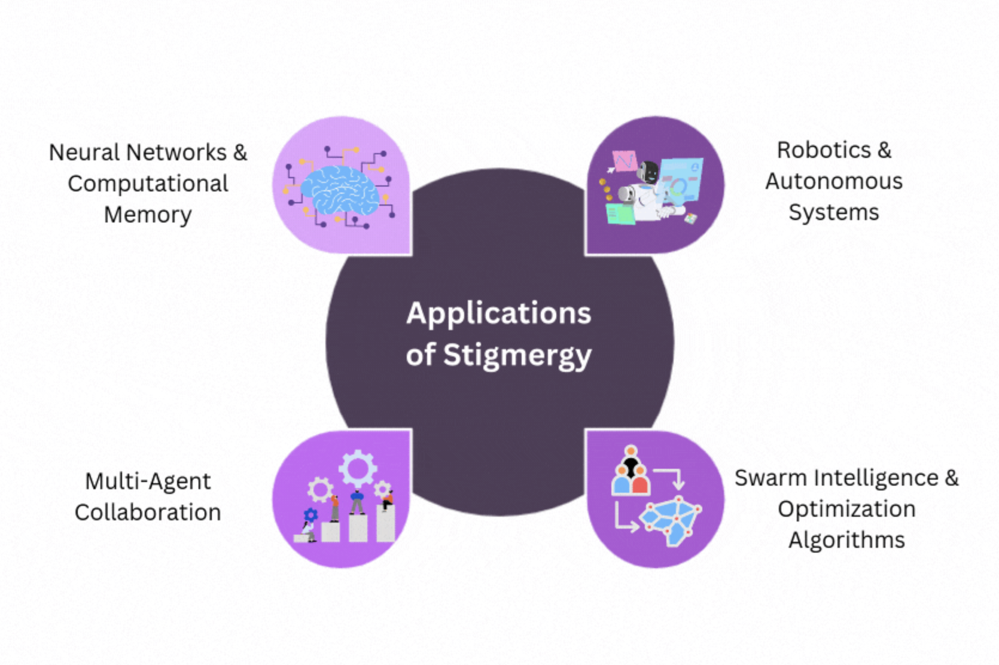
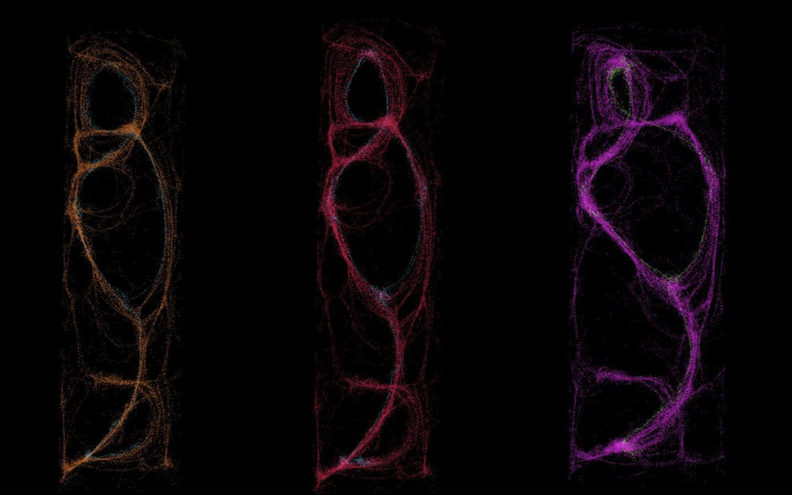

- 
-
- Aristotle: Wisdom of the Crowds: potluck feast - everyone contributes dishes
- M. Condorcet *jury theorem*
- W. M. Wheeler: *superorganism*
- **Vernadsky** **Teilhard**: **noosphere**
- **Engelbart** *three people working together in this augmented mode [would] seem to be more than three times as effective in solving a complex problem as one augmented person working alone*
- **ant colonies, bee hives, and bird flocks**
- complex problems (finding shortest paths to food, allocating tasks, or navigating long migrations) without central control. This led to the field of **swarm intelligence**
- **Ant Colony Optimization (ACO)**, first proposed by Marco Dorigo
- Traveling Salesman Problem
-
- simple local rules => complex collective search and optimization
- Methods
	- random walk
	- stigmergy
		- 
		- 
	- market
	- longest chain rule
	- conway's game of life
		- 
- emergence
- MIT Center for Collective Intelligence Thomas Malone
- **c-factor** Anita Williams Woolley
- https://gixstanford.wordpress.com/wp-content/uploads/2012/11/woolley-et-al-2010.pdf
	- social sensitivity of group members
	- the equality in distribution of conversational turn-taking
	- and the proportion of females in the group.
- **between human and machine collective intelligence are blurring**