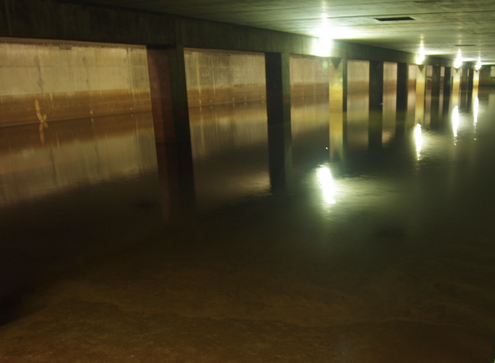

- title: regenerative volcanic-to-glacial water purification and revitalization system
  
  ---
  
  description:
  
  this document presents the full design and principles behind a passive, modular, earth-based water purification and revitalization system. the system transforms mineral-rich but problematic volcanic spring water into safe, structured, antioxidant water with the clarity and vitality of glacial melt.
  
  ---
  
  section 1: filtration + purification layers
  
  layered bed from top to bottom:
- schmutzdecke
	- 
	- 
	- handles: most bacteria, protozoa, viruses
- top layer: fine volcanic sand
	- slow sand filter
	- supports biological layer
	- removes turbidity
- upper mid: biochar
	- hot-water-quenched from local sengon
	- adsorbs organic compounds, odors, supports microbial life
	- binds moderate metals and enhances cation exchange
- middle: laterite
	- strongly binds aluminum, phosphate, arsenic
	- improves metal detoxification
- lower mid: limestone
	- raises pH
	- causes precipitation of aluminum and iron hydroxides
	- improves taste and softens acidity
- lower: coral sand
	- enriches with calcium and magnesium
	- enhances alkalinity and soft mineral balance
- base layer: coarse gravel
	- supports drainage
	- maintains even hydraulic flow
	  
	  optional pre-layer: settling tank or cloth mesh for turbidity buffering
	  
	  section 2: post-filtration activation (vitalization chamber)
	  
	  modular layers and capsules:
- mineral capsule: maifan stone
	- releases trace minerals (ca, mg, si, zn)
	- improves taste and texture
	- mildly lowers oxidation-reduction potential (orp)
- energetic ceramics capsule: zeolite, tourmaline, germanium stone
	- releases far infrared radiation
	- adds negative ions
	- lowers orp, promotes subtle restructuring
- hydrogen charger: magnesium rods or granules
	- generates molecular hydrogen (h2)
	- reduces orp to antioxidant range (−100 to −300 mv)
	- enhances bioavailability and cell hydration
- ceramic filter: kaolin-based candle
	- final barrier for bacteria, cysts, and microplastics
	- neutral taste, durable, cleanable
	  
	  ---
	  
	  section 3: final structuring module
- vortex cone: porcelain funnel
	- reshapes water flow into spiral vortex
	- promotes coherent water structuring
	- restores natural micro-cluster memory
- copper spiral: wrapped around vortex cone
	- external only
	- conducts and guides energetic flow
	- harmonizes field structure
	- amplifies centripetal energy memory
	  
	  ---
	  
	  section 4: output, storage, and transport
	  
	  storage design strategy:
- basalt tanks (emergency, long-term)
	- use: backup reserves, deep storage
	- benefits: zero leaching, cool/dark, altar aesthetics
	- optionally sealed with roman concrete
- natural planted ponds (main seasonal buffer)
	- use: primary open-air storage for rainwater and runoff
	- benefits: ultra-low cost, regenerates biodiversity, fast capture
	- filtration system ensures water quality regardless of biofilm presence
- clay jars (mid-scale, transport)
	- use: daily use, moving water from system to household
	- benefits: breathable, neutral to taste, handmade, sustainable
	- replace unsafe plastic gallon bottles
- lab-grade borosilicate glass (personal use)
	- use: sampling, research, children’s consumption
	- benefits: inert, transparent, best for hydrogen retention
	  
	  note on plastic bottles:
- standard 20 l plastic bottles (pc or pet) can leach bpa, antimony, or microplastics over time
- especially unsafe under sunlight or heat
- not suitable for long-term water storage or high-quality water
  
  transport infrastructure:
- lime green ppr pipes (polypropylene random copolymer)
	- chemically inert, no taste or orp alteration
	- preserves hydrogen content and structured water integrity
	- uv-resistant when shaded or buried
	- low-cost, long-lasting, and modular
	- joints should use heat fusion, not glue
	- the water can be retreated after transportation for power vital properties
	- lime ppr is superior to stainless steel
	  
	  ---
	  
	  section 5: performance expectations
- pH: 6.8–7.4
- turbidity: < 0.3 ntu
- aluminum: < 0.05–0.2 mg/l
- total coliforms / e. coli: 0 mpn/100 ml
- orp: −50 to −300 mv
- h2 content: 0.5–1.5 ppm (if magnesium present)
- taste: soft, slightly sweet, alive
- structure: microclustered, restructured, negative charge dominant
  
  ---
  
  section 6: regeneration and maintainability
- all stones are washable and reusable
- biochar can be replaced every 6–12 months
- spent biochar must be recycled directly into soil
	- acts as a slow-release mineral sponge
	- supports microbial life
	- improves soil structure
	- and completes a regenerative carbon–water–soil loop
- kaolin candle filter should be cleaned regularly and replaced when flow declines
- copper spiral never degrades
- magnesium rods replaced when bubbles decline
  
  ---
  
  section 7: storage life
- in clay jars (sealed, shaded): 3–7 days optimal, 14 days max
- in lab glass bottles (airtight): 5–14 days with full vitality
- in natural ponds (for source water): indefinitely before filtering
- in basalt tanks (sealed, underground): months to years if needed
- hydrogen and structure may decline after a few days; taste may evolve
  
  ---
  
  section 8: pricing tiers and strategy
  
  initial premium strategy → expansion to access
  
  | 
  | model | 
  | description | 
  | price (idr / 20l) | 
  |
  
  | ---- |
  
  | 
  | premium one-off | 
  | elite delivery to retreats, villas, select homes | 
  | 150,000 | 
  |
  
  | 
  | subscription (1–3x/wk) | 
  | committed weekly delivery with jar return | 
  | 100,000–120,000 | 
  |
  
  | 
  | daily household refill | 
  | shared refill model via neighborhood tanks | 
  | 60,000–80,000 | 
  |
  
  | 
  | community subsidized | 
  | co-op and rural partnerships with distributed filtration points | 
  | 30,000–50,000 | 
  |
- phase 1 focuses on fast cashflow from premium clients with strong margins
- phase 2 enters broader market with controlled pricing and local support
- strategy balances branding, social impact, and infrastructure scale-up
  
  ---
  
  closing:
  
  this system synthesizes the forces of earth (mineral), fire (ceramic), water (flow), and air (vital energy) into a complete regenerative drinking water altar. it honors natural materials, open flow, and structure — producing water that is not only safe and clean, but alive, structured, and healing.