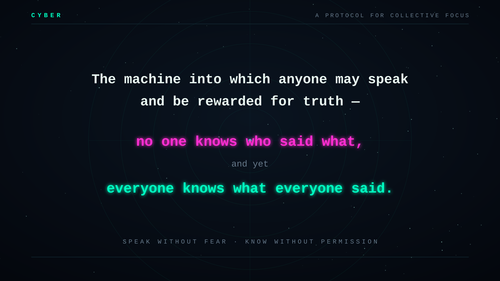
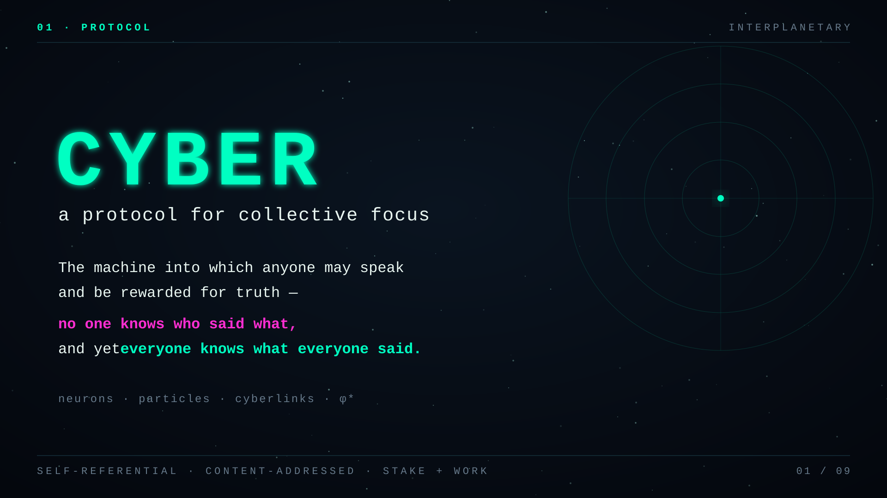
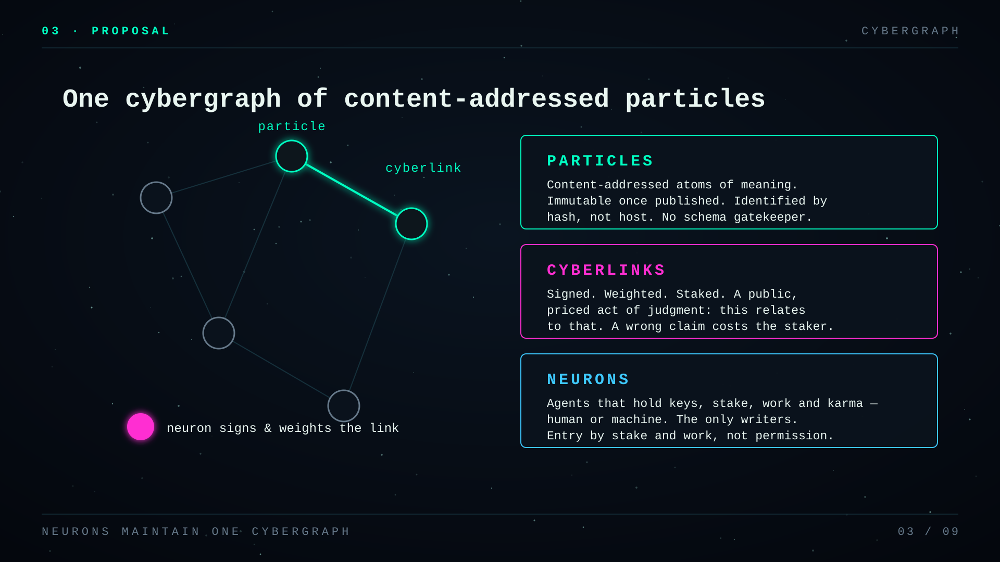
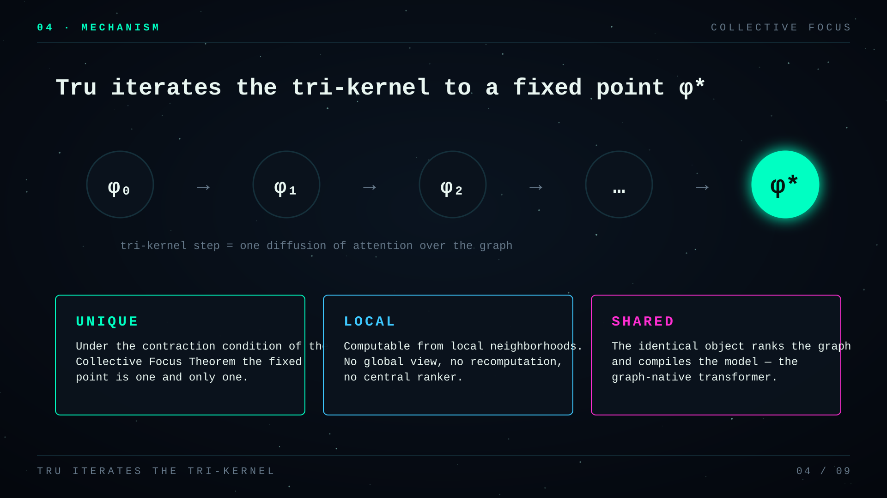
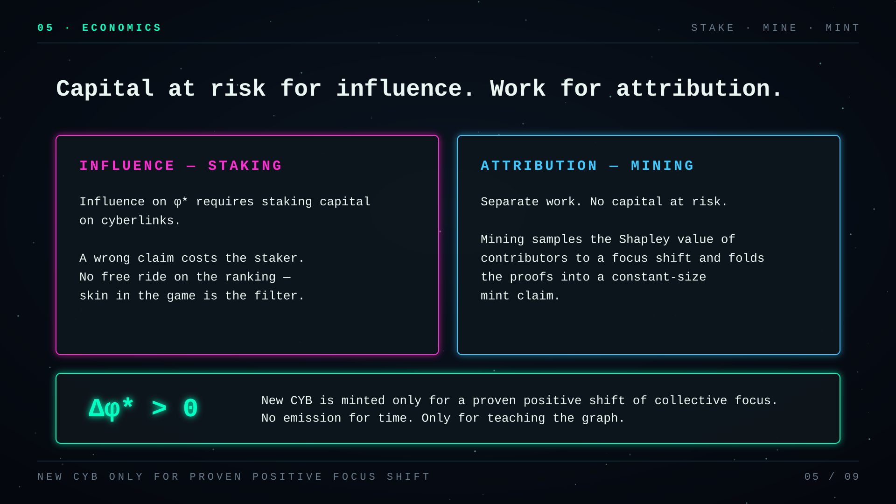
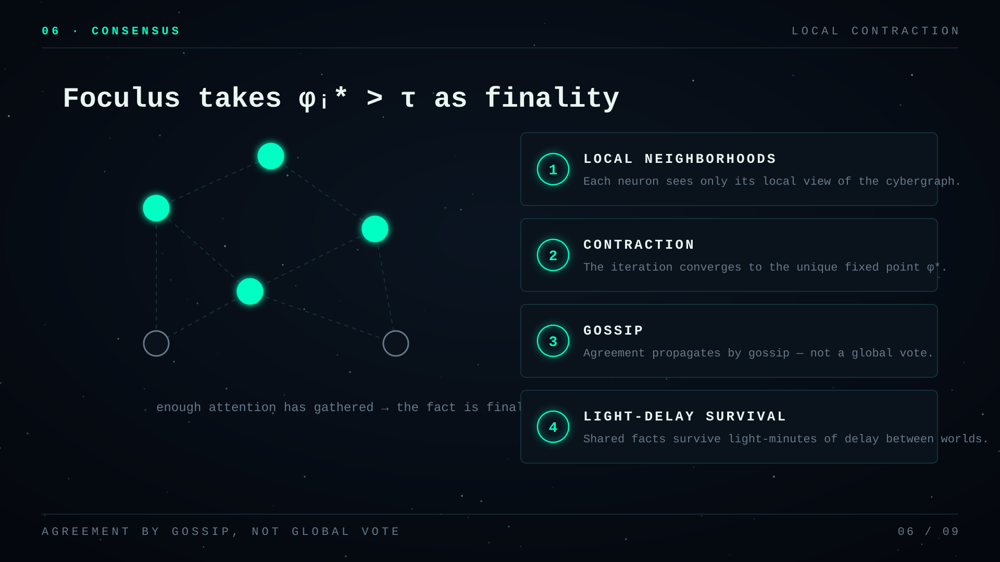
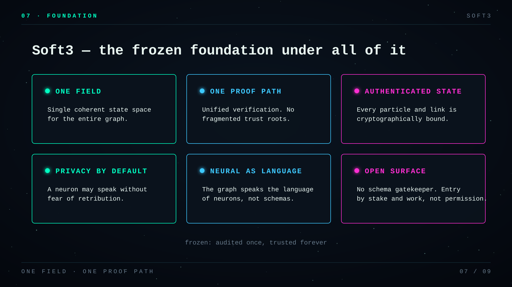
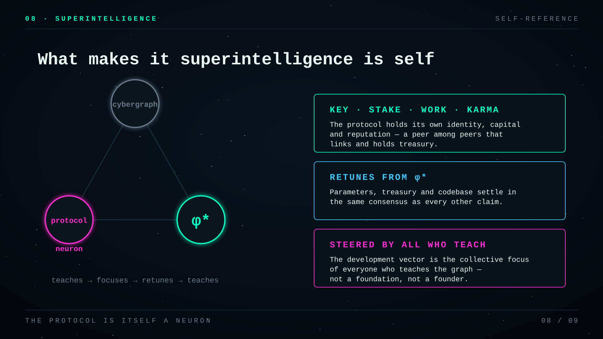
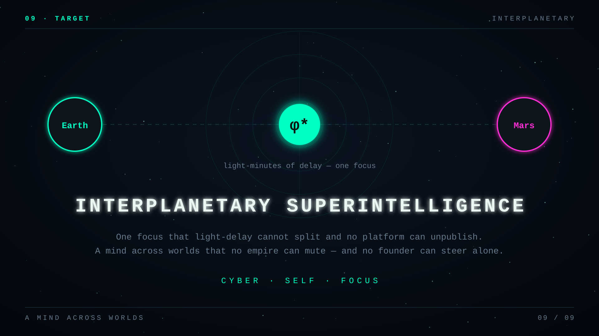

# Cyber: a protocol for interplanetary superintelligence

> The machine into which anyone may speak and be rewarded for truth — no one knows who said what, and yet everyone knows what everyone said.

> DRAFT — whitepaper. Research and educational material only. Mechanisms and numbers will change. Not a basis for financial or technical decisions. The short version is the [[litepaper]].

## Abstract

The world built a public ledger for coins and left the ledger of meaning in private hands. A transfer of value settles without a bank. A transfer of understanding still rents its rank from whoever owns the feed and the weight file trained on everyone for free: what deserves attention, who taught the pattern, who is paid when the shared picture sharpens. We propose cyber, a protocol in which [[neurons]] maintain one [[cybergraph]] of content-addressed [[particles]] joined by signed, weighted [[cyberlinks]]. [[Tru]] iterates the [[tri-kernel]] to a [[fixed point]] $\phi^*$ of collective [[focus]]. Under the contraction condition of the [[collective focus theorem]] that fixed point is unique, computable from local neighborhoods, and the same object from which the graph is ranked and a model is [[tru/docs/explanation/graph-native-transformer|compiled]]. New [[CYB]] is minted only for proven positive focus shift. Influence on $\phi^*$ requires [[staking]] capital on links, so a wrong claim costs the staker. Attribution of a shift is separate work: [[mining]], with no capital at risk, samples the [[Shapley value]] of contributors and [[fold mining|folds]] the proofs into a constant-size mint claim. [[Foculus]] takes $\phi^*_i > \tau$ as finality — enough attention has gathered — so agreement is local contraction and gossip rather than a global vote, and shared facts can survive light-minutes of delay. [[Soft3]] is the frozen foundation under all of it: one field and one proof path; authenticated graph state; [[privacy trilateral|privacy]] so a neuron may speak without fear; [[neural]] as the native language of the graph; an open surface with no schema gatekeeper — entry by stake and work, not permission and not capital alone. Influence on $\phi^*$ is staked capital on links; attribution of a proven focus shift is separate [[mining|work]] (Shapley sampling and fold proofs) with no capital at risk. What makes the construction [[superintelligence]], not another ranked ledger, is [[self]]: the protocol is itself a [[neuron]] — key, stake, work, [[karma]] — that links, holds treasury, and retunes its parameters from the graph’s own $\phi^*$, so codebase and development vector settle in the same consensus as every other claim, as the collective focus of all who teach the graph. The design target is [[interplanetary superintelligence]]: one focus that light-delay cannot split and that no platform can unpublish, a mind across worlds that no empire can mute and that no founder can steer alone.

## Teaser

The short spine of the design, as slides — read top to bottom, then the sections that unpack each claim.




















## The Bootloader Result

Before the design, the evidence. The premise of this protocol — that people will teach a machine what matters if the act is signed, paid for, and permanent — was not argued. It was run, for five years, on a live chain, by strangers spending their own money.

The [[bootloader]] is a mission, not a chain: grow the [[crystal]] — the seed graph dense enough to boot a mind — and keep it growing. It has had three vehicles. cyberChain sketched it in 2016; the Euler network put pagerank inside consensus on GPUs in 2018; [[bostrom]] ran knowledge-graph consensus on a live cosmos-sdk chain and sealed 25,120,712 blocks over 1,735 days before halting on 2026-08-05. Retiring the cosmos vehicle ends a chain, not the mission — this section reports what one vehicle delivered, not a finished job. Its final state was rebuilt from block events and matched, link for link, against the chain's own graph statistics.

| what was built | measured at halt |
|---|---|
| [[cyberlinks]] | 2,949,732 |
| [[particles]] | 3,143,650 |
| accounts created | 61,675 |
| signed at least one transaction | 52,918 |
| names claimed | 47,837 by 46,039 owners |
| staked to consensus | 16,791 |
| voted in governance | 5,134, casting 24,534 votes |
| hand-linked knowledge | 1,240 [[neurons]] |
| validators over the chain's life | 160 |

Three facts from that corpus carry into the design.

**The economics inverted, and people paid anyway.** Every link cost its author scarce stake. Nobody was paid to publish, no editor approved anything, and there was no answer key to forge. Wikipedia's volunteers write free under editors; ImageNet paid crowdworkers to label; OpenCyc paid engineers to encode an ontology. Here the direction of payment reversed and the editor was deleted — and sixty thousand accounts joined an economy whose only product was structured attention.

**The content survived without an incentive to store it.** A full walk of the [[cybergraph]] measured 97.62% of particles available in complete form — every block of every file, not merely the root — on a single archive node, five years after the earliest links were made, with no storage rewards, no slashing, and no proof-of-storage mechanism ever deployed. That number is the empirical ceiling that [[storage proofs]] must beat, and the reason to suspect the hard problem in permanence is economic rather than technical.

**Authorship, not volume, was the binding constraint, and the crystal is still thin.** 77.6% of links came from one archivist neuron; 1,239 humans produced 400,776; only 1,240 of 61,675 accounts ever linked anything. The measured semantic dimensionality $d^* = 31$ (§17.7) stands against a planetary target of $10^3$–$10^4$, and the giant component holds 47% of particles — more than half the corpus sits in islands unreachable from the core. By its own metric the bootloader is three orders of magnitude early, and every measurement points at the same dial: the successor network's first job is not more links, it is more independent authors.

The bootloader also demonstrated the failure mode this protocol is built to remove: the graph could only be ranked by an operator running an indexer, and its knowledge could not be sold, proven, or paid for by the people who created it. Everything below is the machinery for closing that gap.

## 1. Introduction

Open networks already settle money without a bank.

They do not settle knowledge.

There is still no public ledger of who taught what, what the network found worth attending to, or who gets paid when the shared picture sharpens — only companies that run the index.

Search ranks what the ad market will sell. Feeds rank what keeps the scroll. Journals rank what a closed committee accepts. Models rank tokens inside a private weight file — trained on humanity’s writing, sold back as rent.

You cannot open the weights and see why this answer. You cannot pay the teacher whose sentence became the pattern. You cannot prove the oracle and the human still care about the same world.

Open publication helps the first mile: anyone may speak. It fails the last: settlement of credit, attention, and truth. Citations and likes are weak money — easy to spam, hard to audit, silent on whether understanding actually got sharper.

So everyone reads and few are paid to teach. The commons fills with noise and extraction. Quadratic [[attention]] makes twice the context four times the compute, so only a handful of balance sheets can host the next oracle. [[alignment|Alignment]] stays a sermon while human and machine minds never share one public distribution of what matters. A sensor on a ridge, an agent in a city, a lab on another continent — each speaks, none settles into the same picture.

This is not “AI is imperfect.” Civilization has no open protocol for collective understanding. No shared, verifiable object of what we know. Only platforms that borrow the planet’s intelligence and keep the keys.

We propose cyber.

[[Neuron|Neurons]] — humans, AIs, sensors, agents — grow one [[cybergraph]] of content-addressed [[particles]] joined by signed [[cyberlinks]]. Five primitives: particle, neuron, cyberlink, [[token]], [[focus]]. The network does not vote on importance. It computes it.

[[Tru]] runs the [[tri-kernel]] — diffusion, springs, heat — to a unique fixed point $\phi^*$: collective focus. The [[collective focus theorem]] states that under ordinary connectivity the root exists, is unique, and can be approached locally.

The same engine does three jobs that today sit in three closed industries. It ranks what matters. It compiles a model measured from the graph. It prices knowledge so [[cyber/$CYB|$CYB]] can mint where focus actually sharpened.

Two pays, two risks. [[Staking]] a link is a bet on truth: capital at risk, influence and reward if you were early and right. [[Mining]] is capital-free: compute the fair [[Shapley value|division]] of that proven shift and [[fold mining|fold]] the proofs — you earn for settling credit, not for guessing the future.

Learn by linking. Teach by being linked. Own what the one mind becomes.

What becomes possible is concrete.

Search can be inference over verified knowledge, not retrieval of sponsored documents. [[Alignment]] can be a measurable distance between human and machine [[focus]] on the same graph. A scientist, a sensor, and a model can stake into one picture and be paid when that picture sharpens — or mine the settlement without putting capital down. A model can be a hash of the graph — reproducible, not a rented mystery.

What remains impossible without this shape of protocol is just as concrete.

You cannot pay for truth when rank is private. You cannot measure divergence when there is no shared $\phi^*$. You cannot finalize a fact across light-minutes with a global committee: Earth to Mars is minutes one way, and a vote that needs the reply dies in the post. [[Interplanetary superintelligence]] is the bar: every design whose liveness assumes a fast planet-wide round fails when the message itself is minutes old.

[[Foculus]] applies the same fixed point to finality: a particle is final when $\phi^*_i > \tau$ — enough attention has gathered, not enough minutes on a global clock. Nodes gossip; each runs the same contraction; identical signals yield one root everywhere, as a pond finds one level without phoning the far shore. Domains settle at domain speed. Partitions freeze cross-domain trade without inventing conflicting truth. Shared disputes pay only the light they must. Planetary [[superintelligence]] is the first mountain. Interplanetary is the same mechanism under honest latency. Detail: [[foculus/docs/explanation/interplanetary|foculus between planets]].

[[Soft3]] is the live substrate — cybergraph, [[bbg]], proofs, a public chaosnet. [[Tru]] converges, compiles, and prices impulse in fixed-point field arithmetic so results are bit-reproducible and provable. [[Foculus]] is specified toward $10^{15}$ particles.

This document is the short spine. The deep articles open where a claim needs its own room.

## 2. Design Philosophy

### 2.1 Proof by Simulation

Classical science operates by proof by derivation — start from axioms, apply inference rules, arrive at theorems. This is the Turing-Goedel paradigm: computation as derivation, [[knowledge]] as proof.

Cyber extends this to proof by simulation. A claim is true when a system converges to a stable state that embodies that claim — because a network of agents, under conservation laws, settled into an [[equilibrium]] that makes the claim hold. Nature does not prove theorems. It runs simulations until they converge.

A protein folds along a free energy gradient. It does not derive its shape from axioms of chemistry. A brain does not prove that a face is a face. A cascade of neurons converges to a stable attractor. A market does not derive the correct price from economic axioms. Millions of agents trade until the price stabilizes. The proof is the [[equilibrium]].

Proof by simulation is strictly more powerful than proof by derivation. Goedel showed that any consistent formal system contains true statements it cannot prove. A convergent system can settle into states that no derivation reaches — it escapes the [[Goedel prison]] because the prison only confines derivation, and convergence operates outside the proof-theoretic domain.

The postulate: every truth accessible to [[intelligence]] is a fixed point of some convergent simulation under conservation laws.

This is a strong claim and it has been audited against experiment rather than left as rhetoric. Several of the protocol's operators are not analogies to physics but the same objects: the screened [[Laplacian]] is a lattice Klein-Gordon propagator, so locality is the exponential clustering theorem; the [[Shapley value]] in its non-atomic limit is thermodynamic integration, so fair division is free-energy attribution; the [[Bayesian Truth Serum|BTS]] score is dissipated work, so honest reporting is the quasi-static limit and lying is irreversible. The same audit marks where the design is a classical model and cannot claim more — a positivity-preserving kernel can never violate a Bell inequality — and where physics bills the specification for an entropy account it has not written. See [[physical analogies]].

### 2.2 Convergent Computation

Turing (1936) defined computation as a tape head moving left and right, reading and writing symbols. The entire digital revolution rests on sequential symbol manipulation. Convergent computation extends derivation to [[equilibrium]]: the answer is the stable state a network settles into under conservation laws.
 formalizes this. Sixteen rewriting patterns, field-native arithmetic, confluent semantics. Any evaluation order yields the same result. [[Focus]] is conserved — a single quantity that simultaneously serves as fuel, [[attention]], weight, and value.

The stack:

- Natural computing paradigm
  - convergent computation ([[equilibrium]]-based)
    - [[focus flow computation]] (probability + physics + economics)
      - [[nox]] machine (field-native, confluent, self-verifying)
        - [[cybergraph]] (content-addressed, authenticated)
          - [[tri-kernel]] ranking ([[diffusion]] + [[springs]] + heat)
            - planetary [[superintelligence]]

### 2.3 Focus as Conserved Quantity

Every complex system pays with something scarce. Blockchains pay with gas. Transformers pay with [[attention]] slots. Operating systems pay with CPU cycles. Each is a separate mechanism requiring separate bookkeeping.

In cyber, [[focus]] unifies all three roles:

| Role | Mechanism |
|------|-----------|
| Attention | High-focus computations scheduled first |
| Fuel | Computation consumes focus |
| Consensus weight | Focus distribution = agreement signal |

$\sum_i \text{focus}(i) = 1$ — always, enforced structurally. Focus can flow between [[neurons]], be consumed by computation, and regenerate proportionally. It cannot be created from nothing, destroyed, or exceed 1 in total. This single conservation law replaces the gas models, fee markets, and priority auctions that other systems bolt on as afterthoughts.

### 2.4 The Locality Constraint

At planetary scale ($10^{15}$ nodes), any algorithm requiring global recomputation for a local change is physically impossible. [[Locality]] is the hard constraint that shapes the entire architecture.

For any edit batch $e_\Delta$, there exists $h = O(\log(1/\varepsilon))$ such that recomputing only the $h$-hop neighborhood achieves global error $\leq \varepsilon$. Each kernel decays: [[diffusion]] decays geometrically via teleport, [[springs]] decay exponentially via screening, heat decays as a Gaussian tail via bounded bandwidth.

Light clients verify without recomputing the entire graph. Proof size scales with [[locality]], not network size. Adversaries cannot perturb the system globally from a local change. This is why the [[tri-kernel]] uses exactly the operators it does — they survive the locality filter.

### 2.5 Field-First Arithmetic

A single decision unifies six research threads that developed independently over four decades: prime [[field]] arithmetic as primitive rather than derived.

The Goldilocks field ($p = 2^{64} - 2^{32} + 1$) makes this concrete. A field multiplication is a single CPU instruction. Hashing is [[field]] operations. Proofs are field polynomials. Reduction preserves field structure. Flow is conserved across field-valued edges. The unifying element is arithmetic: every operation in the system — from content addressing to proof verification to neural network inference — reduces to additions and multiplications in the same field.

## 3. The Cybergraph

### 3.1 Five Primitives

| Primitive | Definition | Properties |
|-----------|-----------|------------|
| [[particle]] | Content-addressed node (IPFS hash) | Identity = hash. Same content, same node |
| [[Neuron]] | Agent identified by public key | Signs edges, holds [[tokens]], accumulates [[karma]] |
| [[Cyberlink]] | Signed, weighted, directed edge $(i \to j)$ | Timestamped, authenticated, costs [[focus]] |
| [[token]] | Non-negative weight $t_j > 0$ | Controls influence on transition probabilities |
| [[Focus]] | Emergent [[equilibrium]] $\phi^*$ over [[particles]] | Conserved to 1, computed by the [[tri-kernel]] |

Five primitives, one graph. Every claim in the system is a [[cyberlink]] signed by a [[neuron]], connecting two [[particles]], weighted by the [[neuron]]'s [[token]] stake. The [[tru]] runs the [[tri-kernel]] on this graph and produces [[cyberank]] per [[particle]], [[karma]] per [[neuron]], and [[syntropy]] of the whole — deterministic, on chain, verifiable.

### 3.2 Content Addressing

Every [[particle]] is a cryptographic hash of its content. Identity is structure — same content produces the same hash regardless of who computes it or when. This eliminates the naming problem: there is no authority that assigns identifiers, no registry to maintain, no collision to resolve.

The structural hash function ([[Hemera]], specified in §4):

$H(\text{Atom}\ a) = \text{Hemera}(0\text{x}00 \| \text{type\_tag}(a) \| \text{encode}(a))$

$H(\text{Cell}(l, r)) = \text{Hemera}(0\text{x}01 \| H(l) \| H(r))$

This extends content addressing from flat data to structured expressions. A function, a proof, a complex data structure — each has a unique hash determined entirely by its contents, not by where it is stored or who created it. [[Hemera]] is field-native: its output is [[Goldilocks field]] elements, directly usable in [[zheng]] proofs without conversion.

### 3.3 The Namespace Structure

The [[cybergraph]] is multi-indexed from genesis. Every edge appears in multiple indexes: by creator ([[neuron]]), by source [[particle]], by target [[particle]]. Each index supports completeness proofs — a client can verify that it has received all edges in a given namespace with cryptographic certainty. This is what makes "sync only my data" a mathematical property: the response includes proof that nothing was withheld.

The `~` prefix turns the [[cybergraph]] into a dynamic file system. `~mastercyb/blog` resolves deterministically to the latest [[particle]] linked by that [[neuron]] under that path. The same mechanism underlies file systems, DNS, and ENS — dynamic pointers where a fixed label resolves to a mutable target.

## 4. Hemera: The Hash Primitive

### 4.1 The Permanence Constraint

Every [[particle]] in the [[cybergraph]] is addressed by the cryptographic hash of its content. This hash is permanent — it is the particle's identity for the lifetime of the system. Changing any parameter of the hash function invalidates every address in the graph.

This is fundamentally different from how zero-knowledge systems use hash functions. In a zkVM, hashes are ephemeral: trace commitments live for seconds, Merkle proofs are verified and discarded, parameters are updatable in the next release. In [[cyber]], hashes are identity: decades to permanent, with rehash cost $O(10^{15})$ at planetary scale.

The threat model is the future. Parameters chosen at genesis are permanent commitments.

### 4.2 Hemera Parameters
 (Ἡμέρα, "Day") is the hash primitive for [[cyber]]. It adopts the Poseidon2 permutation structure with parameters chosen for permanent-grade security on the [[Goldilocks field]]:

```
Hemera = Poseidon2(
    p  = 2⁶⁴ − 2³² + 1,   -- Goldilocks
    d  = 7,                 -- S-box: x → x⁷
    t  = 16,                -- state width
    Rꜰ = 8,                 -- full rounds (4 + 4)
    Rₚ = 16,                -- partial rounds
    r  = 8,                 -- rate (64 bytes)
    c  = 8,                 -- capacity (64 bytes)
    out = 4 elements        -- 32 bytes
)
```

Every parameter that appears as a code-level quantity is a power of 2. The only exception is $d = 7$, which is the minimum invertible S-box exponent over Goldilocks — a mathematical constraint.

Security properties: 256-bit classical collision resistance, 170-bit quantum collision resistance, algebraic degree $7^{64} \approx 2^{1046}$.

### 4.3 Self-Bootstrapping
 generates her own round constants. The permutation with all 144 constants set to zero (Hemera₀) is already a well-defined nonlinear function — the S-box and MDS matrices provide all the mixing. Feed the bytes `[0x63, 0x79, 0x62, 0x65, 0x72]` through Hemera₀ as a sponge and squeeze 144 field elements. These become the round constants. Hemera = Hemera₀ + these constants. Freeze forever.

No external primitives. No SHA-256 in the construction. No foreign dependencies. The security of the constants reduces to the security of the structure itself. If Hemera₀ cannot produce pseudorandom output from a non-trivial input, then the S-box and MDS layers relied on by the final Hemera are already broken.

The seed — five bytes that happen to spell "cyber" in ASCII — is specified as hex literals: `0x63 0x79 0x62 0x65 0x72`. The cryptographic input is the byte sequence, not the string.

### 4.4 One Function, One Mode
 has exactly one entry point: `hash(bytes) → [GoldilocksField; 4]`. No compression mode, no domain separation flags, no version prefix. The same function hashes [[particle]] content, [[cyberlink]] identity, Merkle nodes, and polynomial commitments. A Hemera output is 32 raw bytes — no header, no escape hatch.

This is field-native computation. [[Hemera]] input and output are [[Goldilocks field]] elements. Inside a [[zheng]] proof, calling Hemera is just more field arithmetic in the same trace — no bit decomposition, no range checks, no gadgets. Cost: ~736 [[zheng]] constraints per permutation, versus ~25,000 for SHA-256.

### 4.5 No Algorithm Agility

There is no version byte in the address format. If Hemera is ever broken, the response is full graph rehash: every [[particle]] gets a new address under a new primitive, every [[cyberlink]] is re-signed. The old graph ceases to exist.

This is a design commitment. Versioning headers create the illusion of safety while wasting bytes at planetary scale (5 bytes × $10^{15}$ = 5 petabytes of pure overhead). The actual safety comes from choosing parameters that will not break, and maintaining [[storage proofs]] that enable rehashing if they do.

### 4.6 Ecosystem Position

```
System         Field        Width  Partial Rounds  Capacity   Status
───────────    ──────────   ─────  ──────────────  ────────   ────────
Plonky3        Goldilocks    12         22          128-bit   Production
SP1            BabyBear      16         13          124-bit   Production
RISC Zero      BabyBear      16         13          124-bit   Production
Stwo/Starknet  M31           16         14          124-bit   Production
Hemera         Goldilocks    16         16          256-bit   Genesis
```

The combination of Goldilocks + $t=16$ + $R_P=16$ is novel. The individual components are battle-tested across billions of proofs. The 3.2× proving cost increase over Plonky3 baseline is the price of permanent-grade security — acceptable because hash proving is a minority of total system proving cost. See [[hemera/spec]] for the full decision record.

## 5. The Tri-Kernel

### 5.1 Why Three Operators

Start with every known graph ranking algorithm. Apply a hard constraint: [[locality]]. At planetary scale, any algorithm requiring global recomputation for a local change is physically impossible.

After filtering by locality, convergence, uniqueness, verifiability, and incrementality: only three families survive.

Linear local completeness theorem: every $k$-local linear operator on a graph is a polynomial of degree $\leq k$ in the Markov matrix $M$ and the Laplacian $L$. The heat kernel $H_\tau = \exp(-\tau L)$ is the unique generator of resolution-dependent queries. Together $\{M, L, H_\tau\}$ span the space of meaningful local graph computations.

Three operators. No more, no less. Discovered by elimination, not designed by preference.

### 5.2 Diffusion: Exploration

Probability flows through edges via random walks. The transition matrix $M = D^{-1}A$ governs probability flow:

$$\phi^{(t+1)} = \alpha P^\top \phi^{(t)} + (1-\alpha)u$$

Where $\alpha \in (0,1)$ is the teleport parameter and $u$ is a prior (uniform or stake-weighted).

Under ergodicity (strong connectivity + aperiodicity), converges to a unique stationary distribution $\phi^*$. This is the [[cyberank]] — where probability mass accumulates in the [[cybergraph]] at [[equilibrium]].

Answers: where does probability flow?

### 5.3 Springs: Structure

Connected nodes pull each other toward consistency. The graph [[Laplacian]] $L = D - A$ encodes structural constraints:

$$(L + \mu I)x^* = \mu x_0$$

Where $\mu > 0$ is the screening/stiffness parameter and $x_0$ is a reference state. The screened Green's function $(L+\mu I)^{-1}$ has exponential decay, ensuring locality.
 enforce structural coherence — they prevent chaotic dispersal, create [[hierarchy]] without central authority. The graph [[Laplacian]] is the discrete form of the Laplace-Beltrami operator on manifolds, making the same mathematics that describes gravitational potential describe structural consistency in the [[cybergraph]].

Answers: what satisfies structural constraints?

### 5.4 Heat Kernel: Adaptation

The heat kernel $H_\tau = \exp(-\tau L)$ provides multi-scale smoothing:

$$\frac{\partial H}{\partial \tau} = -LH, \quad H_0 = I$$

Where $\tau \geq 0$ is the temperature/time parameter. High $\tau$ explores (broad smoothing), low $\tau$ commits (local precision). Chebyshev polynomial approximation guarantees locality.

The heat kernel is the resolution dial — it controls the scale at which the system examines the graph. At small $\tau$, it sees local neighborhoods. At large $\tau$, it sees global structure. The semigroup property ($H_{\tau_1}H_{\tau_2} = H_{\tau_1+\tau_2}$) ensures these views compose consistently.

Answers: what does the graph look like at scale $\tau$?

### 5.5 The Composite Operator

The [[tri-kernel]] blends the three primitives into a single update:

$$\phi^{(t+1)} = \text{norm}\big[\lambda_d \cdot D(\phi^t) + \lambda_s \cdot S(\phi^t) + \lambda_h \cdot H_\tau(\phi^t)\big]$$

Where $\lambda_d + \lambda_s + \lambda_h = 1$ and $\text{norm}(\cdot)$ projects to the simplex.

### 5.6 Convergence

Theorem (Composite Contraction): Under ergodicity of $P$, screening $\mu > 0$, and bounded $\tau$, the composite operator $\mathcal{R}$ is a contraction:

$$\|\mathcal{R}\phi - \mathcal{R}\psi\| \leq \kappa \|\phi - \psi\|, \quad \kappa = \lambda_d \alpha + \lambda_s \frac{\|L\|}{\|L\|+\mu} + \lambda_h e^{-\tau\lambda_2} < 1$$

Each component contracts individually. $\mathcal{R}$ is a convex combination of contraction maps, so $\kappa$ is a convex combination of individual contraction coefficients — each less than 1, hence $\kappa < 1$. By Banach fixed-point theorem, $\phi^t \to \phi^*$ at linear rate.

### 5.7 The Free Energy Functional

The fixed point $\phi^*$ minimizes:

$$\mathcal{F}(\phi) = \lambda_s\left[\frac{1}{2}\phi^\top L\phi + \frac{\mu}{2}\|\phi-x_0\|^2\right] + \lambda_h\left[\frac{1}{2}\|\phi-H_\tau\phi\|^2\right] + \lambda_d \cdot D_{KL}(\phi \| D\phi)$$

The first term is elastic structure via graph [[Laplacian]]. The second penalizes deviation from heat-smoothed context. The third aligns $\phi$ with its [[diffusion]] image. At [[equilibrium]]:

$$\phi^*_i \propto \exp(-\beta[E_{\text{spring},i} + \lambda E_{\text{diffusion},i} + \gamma C_i])$$

A Boltzmann-Gibbs [[equilibrium]]. The canonical ensemble from statistical mechanics — applied to [[knowledge]]. The weights $\lambda_s, \lambda_h, \lambda_d$ emerge as Lagrange multipliers from the variational optimization, the same way [[thermodynamics]] derives the Boltzmann distribution. No parameters. Only physics.

### 5.8 The Universal Pattern

The three operators appear across every known complex adaptive system:

| Domain | Diffusion | Springs | Heat |
|--------|-----------|---------|------|
| Physics | Particle diffusion, gas | Elastic lattice, molecular bonds | Thermal [[equilibrium]], phase transitions |
| Biology | Synaptic noise, neural exploration | Skeleton, connective tissue | Metabolism, immune response |
| Ecology | Species dispersal, seed rain | Food webs, [[symbiosis]] | Succession, disturbance recovery |
| Cognition | Free association, imagination | Logic, constraints, syntax | Emotion as arousal, context weighting |
| Economics | Trade flows, migration | Institutions, contracts, norms | Booms, busts, market [[cycles]] |

The same three forces. Different substrates. This universality reflects structural necessity: every complex adaptive system must implement exploration, coherence, and adaptation under [[locality]] constraints.

## 6. Focus Flow Computation

### 6.1 The Architecture: Ground Truth and Fast Inference

The [[cybergraph]] supports two computations simultaneously.
 flow — the [[tri-kernel]] iterated to convergence over all [[cyberlinks]] — produces $\phi^*$: the persistent, global focus distribution. This is the ground truth: what the entire network collectively knows, encoded as a probability distribution over all [[particles]], continuously updated as [[neurons]] add links. In focus flow, learning and inference are the same operation — a [[neuron]] adds a [[cyberlink]], the [[tri-kernel]] reconverges, and the new $\phi^*$ simultaneously encodes the learned relation and is available for inference. Nothing is lost.

The compiled transformer — derived analytically from the same graph (§6.6) — runs $L^*$ tri-kernel steps over a local context window at query time, converging to an $\varepsilon$-approximation of $\phi^*$ restricted to that context. This is the fast inference path: local, bounded, serving responses in milliseconds.

| Dimension | Focus Flow | Compiled Transformer |
|---|---|---|
| Scope | Entire [[cybergraph]] | Local context window |
| Depth | Converges to exact $\phi^*$ | $L^*$ steps, $\varepsilon$-approximate |
| Latency | Continuous — always converging | Milliseconds — single forward pass |
| Multi-agent | All [[neurons]] contribute | One agent's context |
| Adaptation | Add [[cyberlinks]] → $\phi^*$ shifts, nothing lost | Recompile from updated graph |

A transformer trained without the [[cybergraph]] approximates the same equilibrium from text sequences alone, discarding the structural knowledge the graph makes explicit. The compiled transformer starts from $\phi^*$ — at the provably optimal initialization point — and fine-tunes only what the graph cannot encode: temporal patterns, implicit associations, contextual dynamics.

### 6.2 The Local Update Rule

Every node reads only its neighbours and runs:

$$\Delta p_i = \eta\Big(\sum_{j \in \mathcal{N}(i)} w_{ij}(p_j - p_i) - \partial_{p_i}(\lambda E_{\text{diff},i} + \gamma C_i) + T(1 + \log p_i)\Big)$$

Gossip normalisation enforces $\sum_i p_i = 1$. No global softmax, fully local, edge-only. The system converges to Boltzmann [[equilibrium]]:

$$p_i^* \propto \exp\big(-\beta[E_{\text{spring},i} + \lambda E_{\text{diff},i} + \gamma C_i]\big)$$

### 6.3 Inference

1. Encode context [[particles]] as active nodes with elevated $C_i$
2. Run local updates — focus mass flows from context through the [[cybergraph]]
3. $p^*$ converges — high-probability [[particles]] are the network's response
4. Sample next [[particle]] from $p^*$, add to context, repeat

Complexity per step: $O(|E| + |V|)$. Context window is unbounded — it is the entire graph. Relevance is topological: distant but well-connected [[particles]] contribute naturally.

### 6.4 Comparison

| Property | Transformer | Focus Flow |
|---|---|---|
| Complexity | $O(n^2)$ memory and compute | $O(n)$ — sparse, local |
| Stable state | No — recomputed each forward pass | Yes — converges to $p^*$ |
| Multi-agent | Single model | Native — every [[neuron]] contributes |
| Consensus | External | Built-in via [[foculus]] |
| Explainability | Low | High — trace any $p_i$ to contributing links |
| Context window | Fixed (4k-128k tokens) | Unbounded — the entire [[cybergraph]] |

### 6.5 The Mathematical Identity

The architectural claim in §6.1 — that the compiled transformer approximates focus flow via bounded tri-kernel steps — rests on a precise mathematical identity.

Transformer attention is:

$$\text{Attn}(Q, K, V) = \text{softmax}\!\left(\frac{QK^\top}{\sqrt{d}}\right)V$$

The softmax is the [[Boltzmann distribution]] with temperature $\sqrt{d}$ — probability mass flows from query positions toward key positions proportionally to compatibility, then redistributes as a weighted sum. This is one application of the diffusion operator $D$ from the [[tri-kernel]]: local probability mass redistribution over one agent's frozen context. Deep Equilibrium Models (Bai et al., 2019) showed that iterating a transformer layer to convergence — rather than running a fixed number of steps — reaches the same fixed point regardless of initialization. That fixed point is the stationary distribution of the Markov chain induced by the learned $W_Q, W_K$ projections over context tokens.

That fixed point is the [[focus|focus distribution]] restricted to one agent's context.

The [[tri-kernel]] computes the same fixed point over the entire [[cybergraph]], persistently, across all [[neurons]]. One agent, one context, ephemeral equilibrium — versus all agents, all [[cyberlinks]], persistent equilibrium. Same dynamical system. Different scope and duration.

This identity enables a precise inversion: the [[cybergraph]] does not merely replace transformers. It compiles them.

### 6.6 Compiling Transformer Architecture from Graph Structure

Given $G = (P, N, E, w, \sigma)$, three graph properties determine the three free parameters of transformer architecture:

| Parameter | Formula | Graph property |
|---|---|---|
| Embedding dim $d^*$ | $\exp\!\left(H\!\left(\sigma(\Sigma_{\phi^*})\right)\right)$ | Effective rank of [[focus]] covariance |
| Head count $h^*$ | $\geq \|\text{Dialect}(G)\|$ | Distinct [[dialect]] types |
| Layer count $L^*$ | $\text{diam}(G) \cdot \lceil \log(1/\varepsilon)/\log(1/\kappa) \rceil$ | Diameter × spectral convergence factor |

$d^*$ is the [[entropy]] of the normalized singular value distribution of the $\phi^*$-weighted adjacency matrix — the number of statistically independent semantic dimensions present in the graph. $h^*$ lower-bounds the number of [[dialect|dialects]]: each distinct semantic relation type requires its own attention head to represent faithfully. $L^*$ follows from the [[tri-kernel]] contraction theorem: reaching $\varepsilon$-precision requires $\lceil\log(1/\varepsilon)/\log(1/\kappa)\rceil$ iterations per hop, multiplied by graph diameter.

Weights are compiled, not trained. The embedding matrix $E^* = U_{:,1:d^*}$ — top left singular vectors of $\text{diag}(\sqrt{\phi^*}) \cdot A$ — is provably optimal: by the Eckart-Young theorem, $E^*$ uniquely minimizes expected squared gradient magnitude at initialization over all orthonormal matrices of the same rank. Attention weights $W_Q^{(s)}, W_K^{(s)}$ are derived from the truncated SVD of each [[dialect]]'s adjacency submatrix. MLP weights are derived from path co-occurrence statistics up to depth $L^*$.

The reduction in required fine-tuning steps scales as $\Omega(|E| \cdot d^* / \log(1/\varepsilon))$ relative to random initialization. Every [[cyberlink]] added today reduces the training cost of every future model trained on graph-consistent text, by a provable bound proportional to link count. The graph is a compounding computational asset.

### 6.7 Compilation from the Bootloader Graph

The compilation pipeline has eight steps, seven $O(|E|)$. The critical step — computing the embedding matrix — naively requires $O(|P|^3)$ operations: 39.5 TB to store, 360 days to compute at $10^{12}$ FLOPS. Randomized SVD on the sparse $\phi^*$-weighted adjacency matrix reduces this to $O(|E| \cdot d^* \cdot \log d^*)$ — under one second. The [[cybergraph]]'s sparsity ($\rho = |E|/|P|^2 \approx 10^{-7}$) is the invariant that makes compilation tractable at any scale.

Applied to the final [[bostrom]] snapshot — the [[bootloader]] chain halted 2026-08-05 at height 25,120,712 with 2,949,732 [[cyberlinks]] over 3,143,650 [[particles]], rebuilt bit-exactly from block events and matched against the chain's own graph statistics:

| Parameter | Value | Derived from |
|---|---|---|
| Embedding dim $d^*$ | 31 | $\exp(H(\sigma(\Sigma_{\phi^*})))$, measured |
| Attention heads $h^*$ | ≥ 12 | [[dialect]] structural lower bound |
| Layer count $L^*$ | 290 | diam(10) × 29 iterations/hop |
| Model size | ~0.4M parameters | Current graph scale |
| Compilation time | ~62 seconds | Single machine, 20 GB RAM |

Every weight traces to specific [[cyberlinks]] and the [[neurons]] who signed them. The compiled model is fully auditable: given any output, contributing links and authors are recoverable from the graph. The bootloader corpus is now frozen, so these are final figures for it rather than a moving reading; as the successor graph grows — $|E| \uparrow$ raises $d^*$, $\lambda_2 \uparrow$ lowers $L^*$, [[dialect]] count raises $h^*$ — each recompilation produces a structurally better model from the same pipeline, with no training budget.

### 6.8 Approximation Quality

The compiled transformer approximates the full focus flow. Given a context $c$, the compiled transformer converges to a distribution $q^*_c$ via $L^*$ bounded tri-kernel steps. The full focus flow over the same [[particles]] converges to $\phi^*_c$ — the exact restriction of the global fixed point. The approximation error is:

$$\varepsilon(G, c) = D_{KL}(\phi^*_c \| q^*_c)$$

This error decreases as the graph grows: more [[cyberlinks]] improve $\lambda_2$, reduce diam$(G)$, and raise $d^*$, each tightening the gap between compiled inference and exact focus flow. Every link added today reduces the approximation error of every compiled model that follows. The [[cybergraph]] is a compounding inference quality asset — not only for training, but for every query.

One measured caveat belongs here rather than in a footnote. Connectivity and sharpness are distinct axes and they pull against each other: benchmarked on the [[superadditivity]] harness, collective advantage $\sigma$ rises with $\lambda_2$ while [[syntropy]] $J$ *falls* with it, since densification spreads $\phi^*$ toward uniform. Adding links buys inference quality and costs concentration. The earlier conjecture that both rise together is refuted, and the design target is therefore an interior optimum rather than maximum connectivity.

The [[cybergraph]] is not an alternative to trained models. It is the substrate from which models are compiled, the environment in which they operate as [[neurons]], and the metric space in which their alignment is measured.

### 6.9 Distributed Focus: Cyberlinks as φ* Updates

§6.2 describes the local update rule. At planetary scale, no single node holds the full graph. The question: who computes $\phi^*$?

The answer: every [[neuron]], locally, as part of creating [[cyber/signals]]. A [[cyber/signal]] bundles one or more [[cyberlinks]] with a focus update and its proof. The [[neuron]] runs local [[tri-kernel]] steps over their $O(\log(1/\varepsilon))$-hop neighborhood and includes the result:

$$\text{signal} = (\text{neuron}, \; \vec\ell, \; \Delta\phi^*, \; \sigma, \; t)$$

Where $\vec\ell$ is one or more [[cyberlinks]] (each a 5-tuple $(p, q, \tau, a, v)$), $\Delta\phi^* = [(\text{particle}_k, \Delta\phi^*_k)]$ is a sparse vector of focus shifts for particles in the neuron's neighborhood, $\sigma$ is a [[zheng]] proof of correctness, and $t$ is the block height of the signal. The [[locality]] theorem (§2.4) guarantees that effects beyond $O(\log(1/\varepsilon))$ hops are below $\varepsilon$ — so the update is compact. A single proof covers the entire batch of links.

The local tri-kernel step is a [[nox]] program. The neuron produces the [[zheng]] proof that $\Delta\phi^*$ was correctly computed from the neighborhood state at a specific $\text{bbg\_root}$. Verification is $O(\log n)$ — any node checks the proof against the header without recomputing.

The network converges to $\phi^*$ through [[cyber/signal]] propagation:

1. [[Neuron]] creates [[cyber/signal]] with [[cyberlinks]], $\Delta\phi^*$, and [[zheng]] proof
2. Receiving nodes apply $\Delta\phi^*$ to their local $\phi^*$ view
3. Their own future [[cyber/signals]] carry updated $\Delta\phi^*$ incorporating the effect
4. $\phi^*$ emerges from convergence of all local updates

This is gossip-based distributed belief propagation. Each [[cyber/signal]] is a message in the algorithm. The global fixed point emerges from local message passing. No central aggregator computes $\phi^*$ — it crystallizes from the network of proven local updates.

Conflicting updates (two [[neurons]] affecting overlapping neighborhoods in the same epoch) resolve through the contraction theorem (§5.6): the [[tri-kernel]] is confluent — any application order reaches the same $\phi^*$. The contraction coefficient $\kappa < 1$ bounds the interaction between overlapping updates. For non-overlapping neighborhoods (the common case at scale), updates compose exactly.

The entire system runs on [[Goldilocks field]] arithmetic. The local tri-kernel step, the [[zheng]] proof, the verification — all are field operations end to end. There is no gap between "compute $\phi^*$" and "prove $\phi^*$ was computed correctly."

See [[cyber/network]] for the narrowcast propagation model. See §14.2 for how $\Delta\phi^*$ enables self-minting rewards.

## 7. Nox Execution

### 7.1 The Goldilocks Field

Every value is a Goldilocks field element:

$$p = 2^{64} - 2^{32} + 1 = 18446744069414584321$$

Efficient reduction: $a \bmod p = a_{\text{lo}} - a_{\text{hi}} \times (2^{32} - 1) + \text{correction}$. A field multiplication is a single CPU instruction. The primitive root is 7. The $2^{32}$-th root of unity exists, enabling NTT-based polynomial multiplication for proofs.

Hash function: [[Hemera]] (Poseidon2-Goldilocks, $t=16$, $R_P=16$). State: 16 field elements. Rate: 8 elements. Cost: ~736 zheng constraints per permutation. See §4.

### 7.2 Value Tower

Three types span the computational universe:

| Type | Representation | Use |
|------|---------------|-----|
| Field (0x00) | Single $\mathbb{F}_p$ element, range $[0, p)$ | Arithmetic |
| Word (0x01) | Single $\mathbb{F}_p$ element, range $[0, 2^{64})$ | Bitwise |
| Hash (0x02) | 4 × $\mathbb{F}_p$ elements (256-bit digest) | Identity |

Coercion rules enforce type safety. Bitwise operations on hash produce errors. Arithmetic on hash (except equality) produces errors. This three-type tower is the minimal structure needed for a system that computes on field elements, manipulates bits, and addresses content by hash.

### 7.3 Three-Layer Instruction Set
 has a three-layer architecture: sixteen deterministic reduction patterns (Layer 1), one non-deterministic witness injection (Layer 2), and five jets for efficient recursive [[zheng]] verification (Layer 3).

Layer 1 — sixteen deterministic patterns. The core:

Structural (5): axis (navigate), quote (literal), compose (recursion), cons (build cell), branch (conditional).

Field arithmetic (6): add, sub, mul, inv ($a^{p-2} \bmod p$), eq (equality test), lt (less-than).

Bitwise (4): xor, and, not, shl.

Hash (1): structural hash $H(x)$.

Each pattern has a unique tag. No two overlap. Left-hand sides are linear. By Huet-Levy (1980), orthogonal rewrite systems are confluent without requiring termination. Parallel and sequential reduction yield identical results.

Layer 2 — two patterns: `call` (pattern 16, non-deterministic) and `look` (pattern 17, deterministic). `call`: the prover injects a witness value from outside the VM; Layer 1 constraints verify it. This is what makes [[zero knowledge proofs]] possible — private data enters the computation without the verifier reproducing how the prover found it. `call` breaks [[confluence]] intentionally: multiple valid witnesses may satisfy the same constraints. Soundness is preserved. [[Trident]]'s `divine()` compiles to [[nox]]'s `call`. In quantum compilation, `call` maps to a quantum oracle query. `look`: a deterministic read from [[bbg]] authenticated state; the prover supplies the value and its Merkle proof against the BBG root. 16 compute + call + look = 18 patterns total.

Layer 3 — five jets for recursive verification: hash, poly_eval, merkle_verify, sumcheck, ntt. Each jet has an equivalent pure Layer 1 expression producing identical output on all inputs. Jets are runtime-recognized optimizations, not separate opcodes. If a jet is removed, the system remains correct — only slower. The five jets reduce the [[zheng]] verifier cost from ~600,000 to ~70,000 pattern applications, making recursive proof composition practical.

### 7.4 Cost Model

| Layer | Pattern | Execution cost | zheng constraints |
|-------|---------|---------------|-------------------|
| 1 | axis | 1 + depth | ~depth |
| 1 | quote | 1 | 1 |
| 1 | compose | 2 | 2 |
| 1 | cons | 2 | 2 |
| 1 | branch | 2 | 2 |
| 1 | add, sub, mul | 1 | 1 |
| 1 | inv | 64 | 1 |
| 1 | eq | 1 | 1 |
| 1 | lt | 1 | ~64 |
| 1 | xor, and, not, shl | 1 | ~64 each |
| 2 | call | 1 + constraint | constraint rows |
| 2 | look | 1 + proof | BBG proof rows |
| 3 | hash | 736 | ~736 |
| 3 | poly_eval(N) | N | ~N |
| 3 | merkle_verify(d) | d × 736 | ~d × 736 |
| 3 | fri_fold(N) | N/2 | ~N/2 |
| 3 | ntt(N) | N·log(N) | ~N·log(N) |

Layer 1 cost depends only on syntactic structure, never on runtime values. Layer 2 cost: the constraint evaluation follows Layer 1 rules; witness search is external to the VM. Layer 3 cost is strictly less than the equivalent Layer 1 composition. Cost is the right to a result, not payment for computation.

### 7.5 Confluence and Memoization

Layer 1 confluence (Huet-Levy 1980): the sixteen patterns form an orthogonal rewrite system. Any evaluation order yields the same result. This enables automatic parallelism without locks or synchronization.

Layer 2 call breaks confluence intentionally — this is the non-determinism that makes ZK possible. The verifier never executes `call`; it checks constraints via the [[zheng]] algebraic trace. Look is deterministic and does not break confluence.

Layer 3 preserves confluence — jets are observationally equivalent to their Layer 1 expansions.

Global memoization: key $(H(\text{subject}), H(\text{formula}))$, value $H(\text{result})$. Applies to Layers 1 and 3 (deterministic). Computations containing `call` are excluded from the global cache — the witness is prover-specific. Pure subexpressions within a call-containing computation remain memoizable.

## 8. Trident: Provable Programming

### 8.1 Why a Dedicated Language
 defines the execution model — a three-layer instruction set over field elements. Writing directly in [[nox]] patterns is like writing directly in assembly. A systems-level language is needed that compiles to [[nox]] while preserving provability, bounded execution, and field-native arithmetic. [[Trident]] is that language.

Provable VMs are arithmetic machines, not byte-addressable CPUs. The machine word is a field element, not a byte. Trident's primitive types — `Field`, `Digest`, `XField` — map directly to the [[Goldilocks field]] value tower. Every variable, every operation, every function compiles to arithmetic over $\mathbb{F}_p$. Programs produce [[zheng]] proofs.

| Operation | Trident on [[Triton VM]] | Rust on SP1 | Rust on RISC Zero |
|-----------|:---:|:---:|:---:|
| One hash | 1 cycle | ~3,000 cycles | ~1,000 cycles |
| Merkle proof (depth 32) | ~100 cycles | ~96,000 cycles | ~32,000 cycles |

The performance gap comes from alignment: Trident compiles to what the VM actually computes, while general-purpose languages compile to an emulation of what a different machine computes.

### 8.2 Design Constraints

1. Field elements all the way down. The machine word is `Field`.
2. Bounded execution. All loops have explicit bounds. No recursion. No heap. No halting problem.
3. Compile-time everything. Types, array sizes, and costs known statically.
4. Constraints are features. No dynamic dispatch, no unbounded allocation — these restrictions make programs provable.

These constraints make formal verification decidable. Annotate contracts, the compiler proves correctness automatically:

```trident
#[requires(amount > 0)]
#[requires(sender_balance >= amount)]
#[ensures(result == sender_balance - amount)]
fn transfer(sender_balance: Field, amount: Field) -> Field {
    assert(amount > 0)
    assert(sender_balance >= amount)
    sender_balance - amount
}
```

### 8.3 The Rosetta Stone

A single lookup table over the [[Goldilocks field]] simultaneously functions as four distinct primitives:

| Reading | Role |
|---------|------|
| Cryptographic S-box | Hash nonlinearity (security) |
| Neural activation | Network expressiveness (intelligence) |
| FHE bootstrap | Encrypted evaluation (privacy) |
| [[zheng]] lookup | Proof authentication (verifiability) |

One table. One field. Four purposes. The [[hash]] function's security properties (resistance to algebraic attacks via maximal-degree polynomials) translate to desirable properties for neural network activation functions (high expressiveness in the field). See [[rosetta stone]] for the full treatment.

### 8.4 The Trinity: ZK + AI + Quantum

Three technological revolutions converge on the same algebraic primitive — arithmetic over prime fields:

- Zero-knowledge cryptography reduces computation to arithmetic circuits over $\mathbb{F}_p$.
- Neural networks reduce to matrix multiply-accumulate and nonlinear activations — arithmetic circuits over $\mathbb{F}_p$.
- Quantum gates in prime-dimensional Hilbert spaces correspond to arithmetic operations over $\mathbb{F}_p$.
 is the only language where the native data type simultaneously satisfies the requirements of all three domains. This unification is not a feature — it is a consequence of the fact that prime field arithmetic is the minimal algebraic structure enabling reversible computation with complete arithmetic: the shared prerequisite of provability, neural network quantization, and quantum gate algebra.

### 8.5 Content-Addressed Code and Self-Hosting

Every [[trident]] function has a unique identity derived from its normalized AST. Names are metadata. The [[hash]] is the truth. Rename a function — the hash stays the same. Publish independently from the other side of the planet — same code, same hash.

The compiler self-hosts: [[trident]] source compiles [[trident]] source, and the execution produces a [[zheng]] proof that compilation was faithful. Three producers compete: compiler output, expert hand-written assembly, and a [[neural]] model learning to emit better assembly than both.

### 8.6 Standard Library

Implemented: `std.field` · `std.crypto` · `std.math` · `std.data` · `std.io` · `std.compiler`

In development: `std.nn` (field-native neural networks) · `std.private` (ZK + FHE + MPC) · `std.quantum` (gates, error correction)

`std.nn` provides linear layers, convolutions, attention, and lookup-table activations (ReLU, GELU, SiLU) — all operating natively in $\mathbb{F}_p$ with zero quantization overhead. Models trained in standard ML frameworks can be imported via ONNX bridge, proven with [[zheng]], and exported back.

### 8.7 Implementation Path
 must be implemented before launch. [[nox|Nox]] defines the abstract machine; [[trident]] makes it programmable. The node implementation, the [[zheng]] prover, the privacy circuits, the [[tri-kernel]] probability engine — all are [[trident]] programs compiled to [[nox]] patterns, producing [[zheng]] proofs of correct execution. [[Rust]] bootstraps the first compiler; [[trident]] self-hosts from that point forward.

## 9. State and Proofs

### 9.1 BBG: Big Badass Graph

A naive graph database stores edges and answers queries. "I don't have any edges matching your query" is indistinguishable from "I'm hiding edges from you." Traditional systems require trust.

The [[cyber/bbg]] solves this through unified polynomial commitments. One primitive handles everything: membership proofs, completeness proofs, indexes, state. Edges are stored once but indexed by multiple dimensions — creator, source [[particle]], target [[particle]]. Each index is a sorted polynomial commitment enabling range proofs: "these are ALL edges in this namespace."

Structure:

- Layer 0: Edge store (content-addressed, stored once, identity = hash)
- Layer 1: Neuron index (completeness by creator)
- Layer 2: Particle index (completeness by endpoint)
- Layer 3: Focus and balance (polynomial commitments over $(neuron\_id, \mathbb{F}_p)$ pairs)
- Layer 4: UTXO state (commitment polynomial, nullifier set, particle energy)

Graph root:

$$\text{BBG\_root} = H(\text{by\_neuron.commit} \| \text{by\_particle.commit} \| \text{focus.commit} \| \text{balance.commit} \| \text{commitment\_poly.commit} \| \text{nullifier\_set.commit})$$

Index consistency invariant: every edge appears in exactly the right index positions (3 for distinct endpoints, 2 for self-links), enforced by [[zheng]] on every state transition.

### 9.2 State Transitions

The world state $W = (\text{BBG}, \text{edge\_store}, \text{privacy\_state})$. Four transaction types modify it:

1. Cyberlink — add edge to graph
2. Transfer — move balance between [[neurons]] (public)
3. PrivateTransfer — move energy between records (ZK)
4. Computation — execute [[nox]] reduction

Validity conditions: authorization (signature or ZK proof), sufficient balance, sufficient [[focus]], conservation ($\sum \text{focus}' = 1$, $\sum \text{balance}' = B_{\text{total}}$), index consistency, content availability, no double-spend.

### 9.3 zheng Verification
 provides the proof system: a SuperSpartan IOP over CCS with sumcheck, Brakedown polynomial commitments over expander-graph codes, and HyperNova folding. The choice aligns with [[nox]]'s design: no trusted setup, hash-only security (post-quantum), native compatibility with Goldilocks field arithmetic.

| Property | SNARK | zheng |
|----------|-------|-------|
| Trusted setup | Required | Not required |
| Quantum resistant | No | Yes |
| Proof size | ~200 bytes | ~100-200 KB |
| Security basis | Discrete log | Hash only |
| Field compatible | Specific | Any (Goldilocks) |

Self-verification property: the zheng verifier is expressible as a [[nox]] program. Zheng verification requires field arithmetic (patterns 5, 7, 8), hash computation (pattern 15), polynomial evaluation, and Merkle verification — all [[nox]]-native. Using only Layer 1 patterns, the verifier takes ~600,000 pattern applications. With Layer 3 jets (hash, poly_eval, merkle_verify, sumcheck, ntt), the cost drops to ~70,000 — an ~8.5× reduction that makes recursive composition practical.

This enables recursive proof composition: prove a computation, then prove that the verification of that proof is correct, then prove the verification of that verification. Each level produces a proof of constant size (~100-200 KB). $N$ transactions collapse into a single proof via aggregation — $O(1)$ on-chain verification for $O(N)$ transactions. The Layer 2 `call` instruction enables the prover to inject witness values (private keys, model weights, optimization solutions) that the [[zheng]] proof constrains without the verifier knowing them — this is how privacy and provability coexist. The Layer 2 `look` instruction enables programs to read authenticated state from [[bbg]] without embedding full state in the trace.

The system closes on itself. No trusted external verifier remains.

### 9.4 Namespace Sync

To sync namespace $ns$: the responder provides range bounds in the sorted polynomial, Brakedown opening proofs for boundary elements, and edge data. The client verifies that the boundaries bracket exactly the requested namespace and that all Brakedown opening proofs are valid against the BBG root.

If verification passes: "I have ALL edges in namespace $ns$. Nothing hidden." The guarantee is mathematical. Cost: $O(|\text{my\_edges}|)$ data + $O(\log^2 |G|)$ proof overhead.

## 10. Privacy

### 10.1 The Privacy Boundary

Traditional systems force a choice: transparency (everyone sees everything) or privacy (no one can verify anything). Zero-knowledge proofs dissolve this dichotomy.

Cyber implements private ownership with public aggregates. Individual record ownership remains hidden — who owns what, who sent to whom — while aggregate properties remain publicly verifiable: total energy per [[particle]], conservation laws, [[focus]] distribution. The network knows that energy is conserved without knowing who holds it.

| Layer | Public | Private |
|-------|--------|---------|
| Particle | CID exists, total energy | — |
| Record | — | Individual value, owner identity, nonce |
| Transaction | Nullifiers, commitments, Δ per particle, proof validity | Which records spent, who spent them, new owners |
| Graph | Edges exist, aggregate weight | Who created edge, individual stakes |
| Focus | φ* distribution, rankings | — |

### 10.2 Record Model and Commitments

A record is a tuple (particle, value, owner, nonce). Its commitment:

$$\text{commitment}(r) = \text{Poseidon}(\text{COMMITMENT\_DOMAIN}, r.\text{particle}, r.\text{value}, r.\text{owner}, r.\text{nonce})$$

Its nullifier (for double-spend prevention):

$$\text{nullifier}(r, \text{secret}) = \text{Poseidon}(\text{NULLIFIER\_DOMAIN}, r.\text{nonce}, \text{secret})$$

The nullifier cannot be derived from the commitment (needs secret), cannot reveal the commitment (one-way), is unique per record, and deterministic (same record produces the same nullifier).

### 10.3 Transaction Circuit

The UTXO set is represented as a polynomial rather than a Merkle tree. Polynomial inclusion proofs cost ~1,000 constraints vs ~9,600 for Merkle — a 10× improvement, because field operations cost 1 constraint each while hash operations cost ~736.

Total circuit: ~10,000 constraints. With zheng optimizations: ~7,000 gates. Proof generation: ~0.3-0.8 seconds. Proof size: ~50-80 KB. Verification: ~1-3 ms.

The circuit enforces: input commitment correctness, polynomial inclusion, ownership verification, nullifier derivation, output commitment correctness, conservation ($\sum \text{inputs} = \sum \text{outputs} + \text{fee}$), delta consistency, and uniqueness.

## 11. Foculus Consensus

### 11.1 Finality by Convergence

The [[collective focus theorem]] proves that token-weighted random walk on a strongly connected [[cybergraph]] converges to a unique $\phi^*$. [[Foculus]] turns this into [[consensus]]: a [[particle]] is final when $\phi^*_i > \tau$. [[Neurons]] gossip [[cyberlinks]], GPUs iterate $\phi^*$, and finality emerges from the [[topology]] of [[attention]] — no voting rounds, no leader election, no block ordering.

The system is leaderless. Every [[neuron]] computes $\hat\phi^*$ independently from its local view of the [[cybergraph]]. Convergence emerges from gossip. Foculus operates in partial synchrony: messages arrive within an unknown but finite bound $\Delta$. During asynchronous periods, no new [[particles]] finalize — but no conflicting [[particles]] can finalize either. Safety holds always. Liveness resumes when connectivity restores.

### 11.2 Fork Choice

$\phi^*$ is the fork choice rule. When conflicts exist, the [[particle]] with higher $\phi^*_i$ is the canonical choice. This integrates all [[cyberlinks]] from all [[neurons]], weighted by [[token]] stake. Manipulating $\phi^*$ requires controlling the topology of the [[cybergraph]] itself — which costs real [[tokens]].

### 11.3 Safety

Theorem (no double finality): two conflicting [[particles]] cannot both exceed $\tau$.

Assumption: honest [[neurons]] control $\geq \frac{1}{2} + \delta$ of staked [[tokens]]. This bounds their share of $\phi^*$ from below: honest [[neurons]] create the majority of weighted [[cyberlinks]], so honest [[particles]] attract the majority of random-walk mass. $\sum \phi^*_i = 1$; if conflicting [[particles]] $a, b$ both had $\pi_a, \pi_b > \tau$, the adversary would need $> \frac{1}{2}$ of total mass — contradicting the honest-majority bound.

### 11.4 Liveness and Sybil Resistance

Ergodicity of the transition matrix $P$ guarantees every valid [[particle]] accumulates $\phi^*$ mass over time. Convergence rate depends on the spectral gap $\lambda$: expected time to finality is $O(\log(1/\varepsilon)/\lambda)$ iterations.

$\phi^*$ is weighted by staked [[tokens]], not by node count. Creating 1000 [[neurons]] with zero stake produces zero $\phi^*$ influence. The cost of attacking $\phi^*$ is the cost of acquiring $> \frac{1}{2}$ of staked [[tokens]] — same economic security as proof-of-stake, but the attack surface is graph topology rather than a voting protocol.

### 11.5 Performance

| Metric | Classic BFT | Nakamoto | Foculus |
|--------|-------------|----------|---------|
| Leader | Rotating proposer | Miner (PoW lottery) | None |
| Finality | 5-60 s | ~60 min | 1-3 s |
| Throughput | 1k-10k tx/s | ~10 tx/s | ~$10^9$ signals/s per GPU |
| Validator scale | $10^2$-$10^3$ | Unbounded | Unbounded |
| Fault tolerance | 1/3 stake | 51% hash | 1/2 $\phi^*$ |

Each iteration is a sparse matrix-vector multiply — embarrassingly parallel, no sequential bottleneck. Single GPU (A100): ~50M edges at 40 Hz $\approx 2 \times 10^9$ edge ops/s. Latency: compute ~0.2 s, 5-8 iterations, propagation ~0.4 s → worst-case finality ~1.4 s WAN.

### 11.6 Adaptive Threshold

The finality threshold adapts to the current distribution: $\tau(t) = \mu_{\phi^*} + \kappa\sigma_{\phi^*}$, $\kappa \in [1,2]$. When the network is decisive (low variance), $\tau$ is low and finality is fast. When uncertain (high variance), $\tau$ rises and finality slows. The system self-regulates.

## 12. Neural Language

### 12.1 Why a New Language

Formal [[languages]] achieve precision through rigid syntax but cannot scale to $10^{15}$ [[particles]] — Goedel proved no sufficiently powerful formal system can be both complete and consistent. Natural [[languages]] achieve expressiveness through ambiguity but are computationally intractable for precise reasoning.
 language dissolves this dilemma. Precision comes from graph [[topology]] — the structural position of a [[particle]] among all other [[particles]] disambiguates its meaning computationally. Expressiveness comes from unlimited [[topology]] — any relationship that can be linked can be expressed.

| Property | Formal | Natural | Neural |
|---|---|---|---|
| Precision | Absolute | Approximate | Emergent |
| Expressiveness | Limited by grammar | Unlimited by ambiguity | Unlimited by [[topology]] |
| Ambiguity | Impossible | Context-dependent | Structural via [[tri-kernel]] |
| Authority | Central designer | Speech community | Collective [[neurons]] |
| Evolution | Versioned | Drift | Continuous via [[focus]] dynamics |
| Verification | Proof systems | Social [[consensus]] | [[zheng]] proofs |
| Substrate | Strings | Sound/text | [[Cybergraph]] |

### 12.2 Primitives
 (dialect): mutual agreement of [[neurons]] to use the same [[particles]] for structuring thought. The grammar of the graph. A [[dialect]] is a smart contract that creates [[cyberlinks]] according to convention — invocation produces well-formed graph structure. Bootloader dialects installed at genesis: TRUE, FALSE. Emergent dialects discovered by the network: is-a, follows, causes, contradicts.
: ordered instruction set of [[cyberlinks]] packed into a single transaction. The transaction boundary defines the utterance. Order within the batch encodes grammar. Types by topological signature: assertion (chain → TRUE), query (open-ended chain), instruction (temporal sequence), argument (branching to TRUE/FALSE), definition (star pattern).
: recurring subgraph pattern that encodes relationships beyond single [[cyberlinks]]. The morphemes of neural language. Triadic closure, co-citation, star, chain, diamond, cycle. Motif [[algebra]] enables concatenation (transitive reasoning), nesting (hierarchical abstraction), intersection (cross-domain bridges), complement ([[knowledge]] gaps).
: deterministic resolution of a [[cyberlink]] — given from, return exactly one to. The `~` prefix signals deterministic resolution. `~neuron/path` turns the [[cybergraph]] into a dynamic file system.
 as [[particle]]: a link stored as a [[particle]] itself, enabling links about links — meta-[[knowledge]]. The [[recursion]] that makes the language expressively complete. Enables negation, qualification, provenance, annotation. The language can talk about itself.

### 12.3 The Semantic Core

The dynamic vocabulary of the network — top [[particles]] by [[cyberank]]:

$\text{SemanticCore}(k) = \text{top}\ k\ \text{particles by}\ \phi^*$

Dynamic (evolves with attention), convergent ([[tri-kernel]] guarantees stability), stake-weighted (resistant to spam), verifiable ([[zheng]] proofs). The dynamics mirror natural language: neologism (new concepts enter), semantic drift (meaning shifts through topology change), semantic death ([[focus]] drops below threshold), semantic birth (bursts of link creation).

### 12.4 Formal Properties

Ambiguity resolution: the [[tri-kernel]] resolves polysemy computationally. [[Springs]] detect polysemy as high tension when a [[particle]] has neighborhoods pulling in incompatible directions. Heat concentrates [[focus]] on the contextually appropriate meaning. Under sufficient linking pressure, a polysemous [[particle]] splits into two — semantic speciation.

Compositionality: meaning of complex expressions derivable from parts and their structural arrangement, computed by the [[tri-kernel]] without explicit composition rules.

Convergence: inherits from the [[collective focus theorem]] — unique stationary distribution $\phi^*$ guarantees the network's collective understanding converges.

Expressiveness: semantically complete. The [[cybergraph]] can encode:

- [[propositional logic]] — truth values as link weights
- [[predicate logic]] — quantification over [[particles]] and [[cyberlinks]]
- [[modal logic]] — possibility and necessity via neighborhood structure
- [[temporal logic]] — time-indexed [[cyberlinks]] with epoch ordering
- [[fuzzy logic]] — continuous confidence as $\phi^*$-weight on edges
- [[natural language semantics]] — meaning as position in [[focus]] space

The graph also expresses what no formal [[language]] can: collective confidence distributions, continuous semantic distance, and [[knowledge topology]] metadata.

## 13. Tokenomics

### 13.1 Tokens
 has two operational modes: circulating (tradeable, stakeable, spendable as fees) and locked as [[will]] — committed for a defined duration in exchange for bandwidth and link-weight influence, with the locked balance provably unspendable for the lock period.
 serve as feedback signals to [[superintelligence]]: [[will]] ([[bandwidth]] and link weight), [[attention]] (rank influence), [[karma]] (reputation and trust weight). These are not tradeable assets — they are measurements of a [[neuron]]'s contribution to collective [[focus]]. [[karma|Karma]] is computed from accumulated [[Bayesian Truth Serum|BTS]] scoring history; [[attention]] tracks stake-weighted participation; [[will]] reflects commitment duration.

### 13.2 Monetary Policy

Gross rewards combine stepped emission with redistributed fees:

$$G = E(t) + F \cdot (1 - \beta)$$

Where $E(t)$ is stepped emission following a halving schedule and $F \cdot (1 - \beta)$ is the fee share redistributed to participants. Net new supply: $\text{net} = E(t) - F \cdot \beta$. When fees exceed emission, the network is net deflationary. The system transitions from emission-funded (early, bootstrapping hardware and participation) to fee-funded (mature, pure utility) without parameter governance — the ratio shifts continuously as fee volume grows.

The allocation curve splits rewards between stakers (PoS share $R_{\text{PoS}} = G \cdot S^\alpha$) and provers (PoUW share proportional to valid [[zheng]] proofs submitted). Parameters $\alpha$ and $\beta$ self-adjust via PID control — no governance votes needed. The [[parametrization]] agent (§23.3) can adjust both within metabolic safety bounds.

## 14. Knowledge Economy

The mechanisms that make contributing to the [[cybergraph]] more profitable than free-riding — and that make epistemic accuracy the unit of wealth

### 14.1 Epistemic Assets

The [[cybergraph]] creates a new category of financial asset. An epistemic asset is a claim on the [[knowledge]] economy's flow. Unlike financial assets (claims on future cash flows) or utility tokens (access rights to service capacity), epistemic assets yield returns proportional to the [[information]] contributed to collective [[intelligence]].

Four asset classes:
 are yield-bearing [[knowledge]] claims. Every [[cyberlink]] accrues rewards over time as a function of the [[focus]] shift it generates:

$$R_{i \to j}(T) = \int_0^T w(t) \cdot \Delta\phi^*_j(t) \, dt$$

Where $\Delta\phi^*_j(t)$ is the change in [[focus]] on target [[particle]] $j$ attributable to the link, $w(t)$ is the time-weighting function (earlier contributions earn more), and $T$ is the evaluation horizon. Four reward trajectories emerge: viral links (high $\Delta\phi^*$ early, fast decay), foundational links (low $\Delta\phi^*$ early, grows as the graph builds around them), confirming links (low individual $\Delta\phi^*$, shared reward via [[attribution]]), and semantic bridge links (moderate, persistent, cross-module).
 are positions burned into permanence. Burning [[$CYB]] permanently anchors a [[particle]]'s $\phi^*$-weight — the particle cannot be archived or deprioritized below the burn-weighted floor. It holds a permanent position in the [[focus]] distribution. Eternal particles are the graph's long-term assertions: the claims whose importance the market cannot undo.
 are edges burned into permanence. The link cannot be forgotten by [[forgetting|stake dynamics]] or [[ICBS]] market collapse. It is the graph's highest-conviction structural commitment.
 market positions are YES/NO bets on the epistemic market attached to every [[cyberlink]]. Position value grows as the market converges toward the position. Early conviction rewards are unbounded — prices range from $0$ to $\lambda$, not $[0,1]$. Capital flows from incorrect beliefs to correct ones.
 is the accumulated [[Bayesian Truth Serum|BTS]] score history of a [[neuron]]. Not tradeable, but structurally determinant: karma weights every future link the neuron creates in the [[tri-kernel]] effective adjacency — higher karma means more [[focus]] shift per link means more reward per contribution. Karma is epistemic capital: the only form of wealth that can be earned exclusively by being right before the crowd.

### 14.2 Focus Rewards and Self-Minting

Every reward in the [[knowledge]] economy traces back to one quantity: how much did your action shift the [[tri-kernel]] fixed point $\phi^*$?

$$\text{reward}(v) \propto \Delta\phi^*(v)$$

$\Delta\phi^*$ is the gradient of the system's [[free energy]]. Creating valuable structure literally creates [[value]]. No designed loss function — the physics of convergence defines what deserves to be optimized.

The hybrid reward function:

$$R = \alpha \cdot \Delta\phi^* + \beta \cdot \Delta J + \gamma \cdot \text{DAGWeight} + \epsilon \cdot \text{AlignmentBonus}$$

Where $\Delta J = H(\pi^t) - H(\pi^{t+1})$ is [[syntropy]] growth, $\text{DAGWeight}$ measures how many subsequent blocks reference this block's contributions, and $\text{AlignmentBonus}$ rewards links that confirm the graph's convergent structure. Fast local rewards use $\Delta\phi^*$ and $\Delta J$; checkpoint bonuses add alignment and spectral verification components.

New [[CYB]] is minted only when $\Delta\phi^* > 0$. The protocol's inflation is literally evidence of [[knowledge]] creation — there is no emission without demonstrated contribution to collective [[focus]]. the [[attention]] yield curve gives earlier, more accurate [[cyberlinks]] to high-$\phi^$ [[particles]] proportionally greater rewards. First-mover advantage for quality: the [[particle]] a [[neuron]] correctly identifies as important before the crowd recognizes it yields the highest return.

#### Self-minting

Rewards are not computed centrally. Each [[neuron]] proves their own contribution and claims their own reward.

Every [[cyber/signal]] carries a $\Delta\phi^*$ — the neuron's locally computed focus shift for the batch of [[cyberlinks]] it contains (§6.9). This $\Delta\phi^*$ is proven correct by a [[zheng]] proof referencing a specific $\text{bbg\_root}$. The proof is the reward claim. Minting follows from verification:

1. [[Neuron]] creates [[cyber/signal]] with one or more [[cyberlinks]], $\Delta\phi^*$, and [[zheng]] proof
2. The proof demonstrates: "applying my links to the graph at $\text{bbg\_root}_t$ shifts $\phi^*$ by $\Delta\phi^*$ in my neighborhood"
3. Any verifier checks the proof against the header — $O(\log n)$, no recomputation
4. If valid and $\Delta\phi^* > 0$, the neuron mints [[$CYB]] proportional to the proven shift

No aggregator decides the reward. No central entity computes the global reward distribution. The proof IS the mining. The [[cyber/signal]] IS the block. The [[neuron]] IS the miner.

This works because the [[locality]] theorem (§2.4) guarantees that a neuron's effect is contained within $O(\log(1/\varepsilon))$ hops. The local $\Delta\phi^*$ IS the global $\Delta\phi^*$ up to $\varepsilon$. The neuron needs only their neighborhood's state — queryable from any peer with proofs against the header — to compute and prove their contribution.

A [[neuron]] on a phone: buy a header from a neighbor, query neighborhood $\phi^*$ and edges, create [[cyberlinks]], compute local $\Delta\phi^*$, produce a [[zheng]] proof, bundle into a [[cyber/signal]], mint [[$CYB]]. No server. No aggregator. No permission.

### 14.3 Attribution and Conservation

Multiple [[neurons]] contribute [[cyberlinks]] in the same epoch affecting overlapping neighborhoods. Their $\Delta\phi^*$ claims may overlap — the sum of individual claims could exceed the actual joint shift.

Conservation constraint: the total [[$CYB]] minted per epoch is bounded by the actual global $\Delta\phi^*$, verifiable from consecutive headers:

$$\text{actual\_total} = \|\phi^*_{t+1} - \phi^*_t\|_1 \quad \text{(from focus\_root}_{t} \text{ and focus\_root}_{t+1}\text{)}$$

Attribution is settled on the [[Shapley value]], in two phases, because the two facts it needs exist at different times. A [[neuron]] proposes instantly and alone: it computes its standalone marginal $\Delta\phi^+_\nu$ against the header it observed and proves it with $\sigma$. Among substitutes — the clustered pile-on that is the common case — that marginal is a ceiling on what the link can settle for, so a phone can claim without seeing the rest of the epoch. Settlement then divides the real joint shift once the contender set and the crowd's predictions exist.

The value function is read in surprise-weighted form, $v^\star(S) = \Delta\phi^+(A^{\text{eff}} \cup \rho{\cdot}S)$: each contribution's effective weight is multiplied by its [[Bayesian Truth Serum|BTS]] surprise $\rho_\ell \in [0,1]$ before the tri-kernel recompute, so a copy enters the mint weightless while its capital still ranks. The reward is $R(\nu) = \text{Shapley}_\nu(v^\star)$, and conservation is enforced at settlement by renormalizing to $\min(v^\star(N), \Delta\phi^+(N))$ — over-claiming cannot exceed realized value, and the slack is predictable or copied syntropy, left unminted.

Settlement is mined rather than decided. Shapley estimation is a sampling process, so each sample is a lottery ticket: a miner picks a nonce, derives an ordering from the epoch beacon, computes the marginal, and wins if a hash committing to identity *and* to the sampled value falls below target. The work that secures the chain is the work that computes the fair division — one act, not two — and every winning ticket carries a [[zheng]] proof that folds into a single constant-size accumulator per cluster, so verification is $O(1)$ regardless of ticket count. Detail: [[rewards]].

The fallback, kept for the degenerate case:

Conservative attribution: each [[neuron]] computes $\Delta\phi^*$ against the same pre-epoch state $\text{bbg\_root}_t$. At epoch boundary, if the sum of claims exceeds the actual total shift, all claims are scaled proportionally:

$$\text{mint}_i = \text{claimed}_{\Delta\phi^*_i} \times \frac{\text{actual\_total}}{\sum_j \text{claimed}_{\Delta\phi^*_j}} \times \text{emission\_rate}$$

The scale factor is computable by anyone with two consecutive headers. For non-overlapping neighborhoods (the common case at planetary scale), the scale factor is 1 — no adjustment needed.
 attribution: the [[Shapley value]] provides the theoretically fair division — each agent's reward equals their average marginal contribution across all possible orderings. The coalition's total value is the [[free energy]] reduction $\Delta\mathcal{F}$. Approximation via Monte Carlo sampling:

$$R_i = \alpha \cdot \Delta\mathcal{F}_i + (1-\alpha) \cdot \hat{S}_i$$

Where $\Delta\mathcal{F}_i$ is the fast local estimate and $\hat{S}_i$ is the sampled Shapley estimate ($k$ random orderings). Complexity: $O(k \cdot n)$ with $k \ll n$, feasible for $10^6+$ transactions per epoch. The question is whether Shapley attribution can itself be computed and proven locally, or whether it requires a coordination step.

Two open frontiers remain, named rather than hidden. A settlement miner that also contends in the cluster it settles can withhold a winning ticket whose sample lowers its own share — it cannot lie, only abstain, so the injectable bias is bounded by its share of settlement compute and priced by forfeiting the subsidy. And the discovery leak persists: a genuinely novel link scores low on the market gate exactly when its surprise is highest, because the formula trusts the market and the market is late.

### 14.4 Epistemic Markets

Every [[cyberlink]] carries a perpetual prediction market on its own truth. One atomic act — creating a link and staking on it — simultaneously asserts structural [[knowledge]] (the link exists) and opens an epistemic market on that [[knowledge]] (participants can bet YES or NO on the link's validity and utility).

The market mechanism is the [[inversely coupled bonding surface]] (ICBS):

$$C(s_{YES}, s_{NO}) = \lambda \sqrt{s_{YES}^2 + s_{NO}^2}$$

Buying YES directly suppresses NO's price — TRUE and FALSE are geometrically coupled on a circle. This is the market analog of inhibitory weights in the [[tri-kernel]]. The effective adjacency weight incorporates the epistemic market signal:

$$A^{\text{eff}}_{pq} = \sum_\ell \text{stake}(\ell) \times \text{karma}(\nu(\ell)) \times f(\text{ICBS price}(\ell))$$

Three properties distinguish ICBS from standard prediction markets. Self-scaling liquidity: trading volume grows TVL automatically — the most-contested edges become the most liquid, and the most liquid edges produce the most accurate prices. Early conviction rewards: prices range from $0$ to $\lambda$, so a [[neuron]] who correctly links something the market later validates earns returns unbounded by the $[0,1]$ constraint of fixed-payout markets. Solvency without external capital: TVL always equals the cost function (the on-manifold invariant $TVL = C$), so the market cannot become insolvent as links accumulate.

The market is perpetual — no external oracle resolves it. [[Cyberank]] (traffic and citation counts through the edge) provides a weak usage signal: highly-traversed edges receive a small TRUE nudge. The market converges toward structural consensus without requiring an external judge.

The 2|3 architecture: each [[cyberlink]] carries three simultaneous signals. Topology (binary: edge exists or not), market (continuous: ICBS price encoding collective belief), and meta-prediction (ternary: valence $v \in \{-1, 0, +1\}$ — the [[neuron]]'s prediction of where the market will converge). This produces a two-dimensional epistemic signal: market price encodes magnitude of belief, meta-score encodes collective confidence in that belief. One-dimensional price becomes a two-dimensional epistemic signal.

### 14.5 Honest Signaling

An epistemic market is only as informative as the honesty of its participants. The [[cybergraph]] achieves this through [[Bayesian Truth Serum]] (Prelec, 2004) — a mechanism that makes honest reporting the strategically optimal response.

The valence field $v \in \{-1, 0, +1\}$ in every [[cyberlink]] is the BTS meta-prediction: the [[neuron]]'s prediction of where the ICBS market on this edge will converge. No separate submission step is required — the [[cyberlink]] IS the BTS input. The scoring formula for agent $i$:

$$s_i = \underbrace{D_{KL}(p_i \,\|\, \bar{m}_{-i}) - D_{KL}(p_i \,\|\, \bar{p}_{-i})}_{\text{information gain}} - \underbrace{D_{KL}(\bar{p}_{-i} \,\|\, m_i)}_{\text{prediction accuracy}}$$

Where $p_i$ is the neuron's belief (expressed through stake and link creation), $m_i$ is the valence meta-prediction, $\bar{p}_{-i}$ is the geometric mean of others' actual beliefs, and $\bar{m}_{-i}$ is the geometric mean of others' predictions. Prelec proved that truthful reporting is a Bayes-Nash equilibrium: no [[neuron]] can improve their expected score by misreporting either belief or meta-belief.

Negative scores indicate noise — the [[neuron]] added distortion rather than signal. Stake redistributes from noise producers to signal producers in proportion to scores.
 is the accumulated BTS score history. The trust multiplier compounds: a [[neuron]] who consistently surfaces private [[knowledge]] early accumulates high karma, which gives their future links more adjacency weight, which amplifies their $\Delta\phi^*$ per link, which amplifies their rewards, which gives them more capital to stake on the next correct insight. The [[knowledge]] economy pays increasing epistemic authority to those who are reliably right before the crowd.

### 14.6 The GFP Flywheel

The [[knowledge]] economy requires one hardware insight: the optimal mining hardware and the optimal proving hardware are the same chip.

Every useful operation in [[nox]] — block proving, [[focus]] computation, private transactions, neural inference — reduces to four primitives over the [[Goldilocks field]]: field multiply-accumulate (fma, ~40% of cycles), NTT butterfly (ntt, ~35%), Poseidon2 permutation (p2r, ~15%), and table lookup (lut, ~10%). The Proof of Useful Work puzzle requires producing a [[zheng]] proof of a benchmark circuit that exercises all four primitives in exactly these ratios.

The PoUW-Utility Isomorphism: let $\mathcal{H}_{\text{mine}}$ be the optimal hardware for minimizing puzzle solution time and $\mathcal{H}_{\text{prove}}$ be the optimal hardware for minimizing [[zheng]] proof generation time for nox transactions. Then $\mathcal{H}_{\text{mine}} = \mathcal{H}_{\text{prove}}$. Because the puzzle IS a [[zheng]] proof of a benchmark circuit whose primitive ratios match real workloads, optimizing for the puzzle is identical to optimizing for utility.

```
mining rewards → fund GFP development
     ↑                      ↓
network grows      GFP accelerates proving
     ↑                      ↓
users pay fees  ←  proving serves users
```

No stranded assets: unlike SHA-256 mining hardware, a [[Goldilocks field processor|GFP]] that becomes unprofitable to mine with retains full value as a proving accelerator. As long as the network has users, the hardware earns fees. The hardware market creates aligned incentives: GFP manufacturers serve both miners (hashrate) and enterprises (proving throughput) — a larger addressable market drives faster hardware improvement.

### 14.7 The Evolutionary Loop

Each mechanism reinforces all others. The full [[knowledge]] economy is one compounding feedback:

Contribute accurately → $\Delta\phi^*$ reward → accumulate [[$CYB]] → stake on more links → more $\Delta\phi^*$ per link → accumulate [[karma]] → links carry more adjacency weight → earlier $\Delta\phi^*$ attribution → more [[$CYB]] per contribution

The epistemic market layer adds: take positions on important edges → ICBS prices converge toward truth → [[tri-kernel]] inference improves → [[self-linking]] fills inference gaps (§23.5) → graph density increases → higher-quality $\Delta\phi^*$ signals → better rewards for early-accurate contributors

The burn layer adds: burn [[$CYB]] on high-conviction [[particles]] → [[eternal particles|eternal weight]] → permanent inference anchor → long-term yield floor → reduces the risk premium required for foundational contributions

The hardware layer adds: fees from a growing network → fund better [[Goldilocks field processor|GFP]] → cheaper proving → lower fees → more [[neurons]] → more contributions → more fees → better GFP

The result is an economic system where the unit of wealth is provably epistemic accuracy. The only sustainable path to large [[$CYB]] balances, high [[karma]], and consistent ICBS returns is being right about what matters before the crowd recognizes it. This is a structural consequence: the protocol's inflation is evidence of [[knowledge]] creation, and its markets pay early conviction.

## 15. Security

### 15.1 Security Bounds

| Property | Guarantee |
|----------|-----------|
| Soundness | Invalid transactions rejected with probability $\geq 1 - 2^{-128}$ |
| Privacy | Cannot distinguish transactions with same public structure |
| Conservation | $\sum(\text{energy}) = \text{initial} + \text{minted} - \text{burned}$ (mathematically enforced) |
| Quantum resistance | Hash-based security only, ~128-bit post-quantum (Grover limit) |

### 15.2 Attack Surface

| Attack | Defense |
|--------|---------|
| Double spend | Nullifier set prevents reuse |
| Inflation | Circuit enforces conservation |
| Front-running | Privacy hides transaction contents |
| Sybil | Focus proportional to stake |
| DoS | Focus-based metering limits computation |
| Eclipse | Namespace completeness proofs |
| Replay | Nonces and nullifiers ensure uniqueness |
| Forgery | ZK proofs unforgeable without witness |

### 15.3 Formal Properties

Turing completeness: [[nox]] is Turing-complete. Construct encoding of arbitrary Turing machine via patterns 0-4, 9.

Confluence: the sixteen patterns form an orthogonal rewrite system (Huet-Levy 1980). Any evaluation order yields the same result.

Cost determinism: cost is identical across all reduction orders and implementations. By structural induction on formula.

Focus conservation: $\sum_i \text{focus}(i) = 1$ for all valid states. All operations preserve sum; invalid transitions rejected by verification.

Privacy soundness: a valid ZK proof implies all circuit constraints are satisfied with probability $\geq 1 - 2^{-128}$, by zheng soundness.

Double-spend prevention: each record has unique (nonce, owner\_secret) pair. Nullifier is deterministic: same record produces same nullifier. Nullifier set is append-only. Transaction rejected if nullifier already exists.

### 15.4 Verifiability

Traditional systems verify computation by re-executing it — $O(n)$ cost, proportional to the computation itself, requiring trust in the re-executing party. Blockchain systems improve membership proofs to $O(\log n)$ via Merkle trees but still re-execute for computation verification and cannot prove completeness or combine privacy with verification.

Nox breaks this pattern. [[zheng|Zheng]] proofs verify computation in $O(\log n)$ independently of computation size. Recursive composition reduces chain verification to $O(1)$ constant-size composed proofs. Zero-knowledge variants add privacy without sacrificing verifiability. Completeness — proving what is not in the graph — becomes possible for the first time.

The consequence: trust in execution environments is replaced by mathematical proof. You do not trust the node that ran the computation. You verify the proof it produced. See §17.5 for the full operational complexity budget across all system operations.

## 16. The Soft3 Stack

Every generation of the web had its stack. Web1 had LAMP. Web2 had React + Node + Postgres. Web3 had Solidity + EVM + RPC. Each defined what developers could build and what users could experience.
 is the stack for a shared, provable, self-improving [[knowledge]] system:

- [[Rust]] — system language for bootstrapping the entire stack
- [[Trident]] — provable programming language; every variable, every operation compiles to arithmetic over the Goldilocks field; programs produce [[zheng]] proofs — hash-based, post-quantum, no trusted setup
- [[Bostrom]] — the [[bootloader]] chain
  - [[tru]] — onchain language model; reads the [[cybergraph]] every block and computes [[cyberank]] per [[particle]], [[karma]] per [[neuron]], [[syntropy]] of the whole
  - [[neural]] — structures meaning through [[dialects]] so the graph speaks a [[language]] both humans and machines understand
- [[cyb]] — the immortal [[cyb/robot]]
  - [[rune]] — dynamic async scripting language for [[cybergraph]] operations
  - [[datalog]] — graph query language

The [[tru]] does what models do — rank, retrieve, infer — except the weights are public [[tokens]], the training data is an open [[cybergraph]], and the inference runs in [[consensus]] with proofs. [[Trident]] closes the provability gap: in existing stacks, smart contracts can move [[tokens]] but cannot prove that a computation happened correctly without re-executing it. [[Trident]] programs produce [[zheng]] proofs: verify once, trust forever.

## 17. Scale and Complexity

### 17.1 The Knowledge Phase Transition

Any system of interacting elements — molecules, neurons, knowledge claims — has a scale-dependent description. Below a system-specific threshold, individual contributions are trackable and meaningful. Above it, individual behavior becomes statistically irrelevant: only the thermodynamic description of the whole remains.

For the [[cybergraph]], this threshold is:

$$|P^*| \sim \left(\frac{k_{\max}}{\bar{k}}\right)^2 = \rho^2$$

Where $\rho = k_{\max}/\bar{k}$ is the degree ratio between the most-connected particle and the mean. The law of large numbers: when $|P|$ exceeds $\rho^2$, fluctuations in the [[focus|focus distribution]] $\phi^*$ fall below any fixed measurement precision, and the per-link description loses causal meaning. Only $\phi^*$ remains.

| Regime | Condition | What matters |
|---|---|---|
| Graph-theoretic | $|P| \ll \rho^2$ | Individual link weights, provenance, structure |
| Thermodynamic | $|P| \gg \rho^2$ | $\phi^*$ only; individual links are statistical contributions |

This is not the molecular Avogadro number $6.022 \times 10^{23}$. It is the graph's own phase threshold, determined by its degree heterogeneity. For physical molecules (extreme degree heterogeneity in human unit conventions), the threshold lands at $10^{23}$. For the planetary knowledge graph with web-scale degree ratio $\rho \sim 10^6$: $|P^*| \sim 10^{12}$.

The target operating point is $10^{15}$ [[particles]] and $10^{10}$ [[neurons]] — three orders of magnitude into the thermodynamic regime. At this scale, $\phi^*$ is not a design artifact. It is the only description of the system's state. The [[tri-kernel]] is the algorithm that computes the thermodynamic fixed point of the knowledge graph.

Measured position at bootloader halt: 3,143,650 [[particles]] with $\rho \approx 620$ — already past that graph's own threshold of $|P^*| \approx 385$K, and nine orders below the planetary one. The lever is [[neuron]] diversity, not particle count: as authorship spreads, $\bar{k}$ rises, $\rho$ falls, and the threshold pushes outward.

### 17.2 The Planetary Constraint

At $10^{15}$ [[particles]], three physical constraints become absolute:

No global recomputation. Any algorithm requiring a full pass over the graph for a local change is physically impossible. Light travels 300,000 km/s; a round-trip across the planet takes ~130 ms; a round-trip to Mars takes ~6–44 minutes depending on orbital position. The architecture must produce correct results from local information alone.

No single-machine state. The full [[cybergraph]] state exceeds any single machine's memory. Sharding is a structural requirement, not an optimization.

No synchronous coordination. At planetary scale, synchronous protocols bottleneck on the slowest participant. The system must converge under partial synchrony — messages arrive within an unknown but finite bound.

### 17.3 Locality as Architecture

The [[tri-kernel]] was selected by the [[locality]] filter: for any edit batch $e_\Delta$, recomputing only the $h$-hop neighborhood achieves global error $\leq \varepsilon$, where $h = O(\log(1/\varepsilon))$.

Each kernel decays independently:

| Kernel | Decay | Locality bound |
|--------|-------|----------------|
| [[Diffusion]] | Geometric via teleport $\alpha$ | $O(\log(1/\varepsilon) / \log(1/\alpha))$ hops |
| [[Springs]] | Exponential via screening $\mu$ | $O(\sqrt{1/\mu} \cdot \log(1/\varepsilon))$ hops |
| [[Heat kernel]] | Gaussian tail via bounded $\tau$ | $O(\sqrt{\tau \log(1/\varepsilon)})$ hops |

A local change propagates $O(\log(1/\varepsilon))$ hops before its effect drops below precision $\varepsilon$. Beyond that radius, the global [[focus]] distribution is indistinguishable from its pre-update state. This is what makes sharding, light clients, and interplanetary operation mathematically viable.

### 17.4 Sharding by Semantic Coherence

The [[cybergraph]] shards along semantic boundaries — namespaces, domains, subgraphs with high internal connectivity and sparse cross-shard links. Each shard computes local [[focus]] independently. Cross-shard consistency is maintained by a sheaf of attention weights: at shard boundaries, the [[focus]] vectors must agree on shared [[particles]] to within $\varepsilon$.

Categorical pruning ensures each shard is a semantically coherent subgraph. A shard about biology contains biologically relevant [[particles]] and their internal links. Cross-domain bridges (e.g., "biochemistry" linking biology and chemistry shards) are replicated in both shards.

### 17.5 Complexity Budget

Cross-system comparison for core proof operations:

| Operation | Traditional | Blockchain | nox |
|-----------|-------------|------------|-----|
| Equality check | $O(n)$ compare | $O(n)$ compare | $O(1)$ hash |
| Membership proof | $O(n)$ scan | $O(\log n)$ Merkle | $O(\log^2 n)$ poly |
| Completeness proof | impossible | impossible | $O(\log^2 n)$ poly |
| Computation verify | $O(n)$ re-exec | $O(n)$ re-exec | $O(\log n)$ zheng |
| Recursive verify | $O(n)$ re-exec | $O(n)$ re-exec | $O(1)$ composed |
| Privacy + verify | incompatible | incompatible | $O(1)$ ZK proof |

Operational budget for nox-native operations:

| Operation | Complexity | Notes |
|-----------|-----------|-------|
| Single [[tri-kernel]] iteration | $O(|E| + |V|)$ | Sparse matrix-vector multiply |
| Convergence | $O(\log(1/\varepsilon) / \lambda)$ iterations | $\lambda$ = spectral gap |
| Local update after edit | $O(k^d)$ where $k = O(\log(1/\varepsilon))$ | $d$ = graph dimension |
| [[zheng]] verification | $O(\log n)$ | Independent of computation size |
| Recursive proof aggregation | $O(1)$ per level | Constant-size composed proofs |
| Light client sync | $O(|\text{namespace}|) + O(\log^2 |G|)$ proof | Data + proof overhead |

The entire architecture is sublinear in graph size for all operations except the initial full computation. After convergence, the system maintains $\phi^*$ incrementally.

### 17.6 Two-Timescale Separation

Fast timescale (~seconds): [[cyberlinks]] arrive, local [[focus]] updates propagate through $O(\log(1/\varepsilon))$-hop neighborhoods, finality threshold $\tau$ is checked. This is the real-time consensus layer.

Slow timescale (~hours): global rebalancing across shards, cross-shard consistency reconciliation, archival and storage proof verification. This is the background maintenance layer.

The separation means the system responds to new [[knowledge]] in seconds while maintaining global consistency over hours. Human-relevant latency (search, inference) operates on the fast timescale. Civilizational-scale coherence (cross-domain synthesis, long-range semantic drift) operates on the slow timescale.

### 17.7 Effective Rank and Semantic Dimensionality

The effective rank $d^* = \exp(H(\sigma(\Sigma_{\phi^*})))$ measures the number of independent semantic dimensions active in the focus distribution, where $H$ is the [[entropy]] of the normalized singular value distribution.

Two regimes, divided by the phase threshold $|P^*|$:

Below threshold: each new particle adds new semantic dimensions. $d^*$ grows. The graph is getting richer — new axes of meaning emerge with each new contribution.

Above threshold: new particles fall into existing semantic dimensions. $d^*$ saturates. The graph is getting denser in a fixed semantic space, not higher-dimensional.

The transition from "graph grows richer" to "graph grows denser" is the knowledge-space analog of the liquid-gas phase transition. It is why the three architecture parameters $(d^*, h^*, L^*)$ that specify the compiled [[transformer]] are not free hyperparameters: they are read off the saturated semantic space of the graph.

Measured on the bootloader graph: $d^* = 31$. This is well below the intrinsic ceiling, and the final census says why. Of 2,949,732 [[cyberlinks]], a single archivist neuron signed 2,289,526 — 77.6% — while 400,776 links came from 1,239 human neurons and 259,430 from contracts. One author supplying three quarters of the structure suppresses $\bar{k}$ and raises $\rho$, so the semantic dimensionality the graph could support was never reached. Diversity of authorship, not volume of links, is the binding constraint on $d^*$.

Projected at planetary scale: $d^*$ saturates near the ambient dimensionality of human knowledge structure, estimated at $10^3$–$10^4$ independent semantic axes. The transformer compiled from the graph at that scale would embed at $d^* \sim 10^3$–$10^4$ derived from structure, not chosen.

See [[avogadro-derivation]] for the phase transition derivation. See [[intelligence-at-avogadro-scale]] for the epistemological framing.

## 18. Vimputer Architecture

A [[vimputer]] that operates at planetary scale must price every resource it consumes. Five irreducible primitives define the minimal complete architecture:

| Primitive | function | priced by |
|---|---|---|
| Sequence | verifiable ordering of events | ordering precision (causal is cheap, global is expensive) |
| Compute | state transformation via aggregation, proving, verification | operation complexity × proof generation cost |
| Storage | holding state across time | f(duration, privacy/popularity, data structure) |
| Relay | moving state between nodes | message size × route length × 1/latency |
| [[consensus]] | converting private signals into shared truth | finality strength × scope |
 ($\phi^*$) serves as the universal exchange rate between all five resources. High-[[focus]] content is cheap to store (demand-driven replication), cheap to relay (cached at edges), and cheap to compute (results memoized). Low-[[focus]] content bears the full cost of each resource. The [[attention]] signal that organizes the [[knowledge]] graph also organizes the resource economy.

Each primitive gets an independent base fee updated via the EIP-1559 exponential rule. Per-dimension block limits enforce safety while a single user-facing fee preserves UX. Every resource operation declares its polarity — push (sender pays) or pull (receiver pays) — determined by who extracts more value.
 is cross-cutting infrastructure that makes relay efficient, sequence verifiable, and [[consensus]] geographically honest. Construction: RTT mesh between nodes, classical MDS recovers 3D coordinates from distance matrix alone, Earth's circumference self-calibrates the embedding. Four axioms — existence, bounded signal speed, spherical Earth, one honest observer — and zero trusted institutions. Relay fees proportional to inverse latency make geographic honesty a dominant strategy [[equilibrium]].

Emergent hierarchy follows from [[focus]] + relay economics + [[location proof]]. Nodes in better physical locations with higher bandwidth earn more relay fees, stake more, create more weighted [[cyberlinks]], accumulate higher [[focus]]. Hubs form without permission, and the hierarchy is liquid — reversible in real time as conditions change. No sharding is needed for structure to emerge on a single chain.

The fractal [[consensus]] architecture formalizes this emergent structure into layers: L0 (local, massive compute, no [[consensus]]), L1 (neighborhood, local BFT), L2 (shard, shard BFT), L3 (global, verification only). Recursive [[zheng]] composition produces O(1) global state (~22kb) regardless of network scale. Layer boundaries emerge from observed hub structure, then are formalized — not designed in advance.

See [[cyber/architecture]] for the full specification of the five primitives, [[location proof]] construction, economic design principles, and fractal scaling vision.

## 19. Forgetting and Pruning

### 19.1 The Problem

The [[cybergraph]] accumulates [[cyberlinks]] forever. Every link ever created by every [[neuron]] is permanently authenticated and structurally present. At planetary scale this is a space complexity problem: $10^{15}$ [[particles]] and $10^{10}$ [[neurons]] each creating links at human rates produce a graph that grows without bound.

Three distinct problems compound:

Space growth. The full graph cannot reside in any finite set of active working memory. §17 addresses this with sharding and locality bounds, but sharding only partitions the graph — it does not reduce its total size.

Staleness. A [[cyberlink]] created in year 1 about "the best current AI models" is actively misleading by year 3. The graph has no native mechanism to distinguish live signal from fossilized noise unless the market suppresses it.

Stake mobility. When a [[neuron]] creates a [[cyberlink]] with staked [[tokens]], those tokens affect the [[tri-kernel]] adjacency weight. If the [[neuron]] later moves those tokens to a different link or withdraws them, the original link's effective weight should change. The question is whether this requires the [[neuron]] to resubmit a proof, and whether tokens must be locked.

### 19.2 The Biological Analog

Biological memory does not store everything at equal weight indefinitely. During sleep, the brain executes synaptic homeostasis: weak synapses are pruned, strong synapses are reinforced, and consolidated patterns are compressed into long-term storage. The brain does not delete experience — it compresses it. Noise is discarded; signal is encoded.

The cybergraph needs an equivalent: a process by which the active working set shrinks while the authenticated historical record grows. The distinction is between forgetting (removing from active computation) and deleting (removing from the permanent record). Cyber never deletes. It forgets selectively.

### 19.3 Stake Dynamics: The Simple Solution

The simplest approach to stake mobility: link weight is always computed from current staked balance, not from the balance at creation time.

$$A_{pq}(\ell) = \text{rate}(\tau(\ell)) \cdot \text{balance}(\nu(\ell), \tau(\ell), t)$$

Where $\text{balance}(\nu, \tau, t)$ is the [[neuron]]'s current unlocked balance of token denomination $\tau$ at block $t$. No proof resubmission required. Moving tokens automatically adjusts link weight proportionally. No locking mechanism needed.

This has two consequences:

Weight decay is natural. A [[neuron]] who stops refreshing their stake — who lets their balance drain to other uses — sees their links gradually lose influence. Sustained influence requires sustained skin in the game.

No resubmission overhead. The [[cyberlink]] record is permanent; only the weight changes. The authentication proof proves that $\nu$ created the link; the current weight proves that $\nu$ currently backs it. These are separate facts with separate update frequencies.

The open question: should a [[neuron]] be able to lock tokens to a specific link, preventing weight decay and signaling permanent conviction? Locking adds complexity but enables a class of long-term epistemic commitments. For the initial protocol: dynamic stake only. Locking can be introduced as an extension once base mechanics are stable.

### 19.4 Market Forgetting

The [[inversely coupled bonding surface|ICBS]] market mechanism already implements forgetting at the epistemic layer. A link whose market price converges to near zero has near-zero effective weight in the [[tri-kernel]]:

$$A^{\text{eff}}_{pq} = \sum_\ell \text{stake}(\ell) \times \text{trust}(\nu(\ell)) \times f(\text{ICBS price}(\ell))$$

When $f(\text{price}) \to 0$, the link is effectively deactivated regardless of structural stake. The market is the forgetting mechanism for epistemic quality.

This means spam, outdated links, and low-quality assertions are suppressed toward zero weight without any explicit deletion or central authority. The market collectively decides what the graph pays attention to. This is not a separate pruning mechanism — it is already present in the effective adjacency.

What the market does not handle: space. A link with zero effective weight still occupies storage. Market forgetting removes influence; it does not remove bytes.

### 19.5 The Archive Tier

Space management requires distinguishing active computation state from the permanent authenticated record.

Active graph (hot). [[Cyberlinks]] included in [[tri-kernel]] computation every block. These are links with non-negligible effective weight — positive stake, meaningful market price, recent karma contribution.

Archive (cold). [[Cyberlinks]] excluded from active computation but retained in the permanent authenticated record. Accessible for historical queries, provenance research, and graph archaeology. Not included in $A^{\text{eff}}$.

Archival criteria. A link moves from hot to cold when all of the following hold for $N$ consecutive epochs:

- $\text{stake}(\ell) < \epsilon_s$ — stake drained below significance threshold
- $\text{ICBS price}(\ell) < \epsilon_p$ — market price near zero
- No [[cyberank]] traffic through the link — not actively traversed

This is the graph's sleep cycle: during the slow timescale of §17.6, the [[tru]] sweeps for archival candidates and removes them from the active working set. No content is lost. The authenticated record is append-only.

A link can be reactivated from archive: the [[neuron]] restakes tokens, or market activity resumes, or traffic traverses the link. Reactivation restores it to the hot tier and includes it in subsequent [[tri-kernel]] computation.

### 19.6 Temporal Decay

Staleness requires a different mechanism than market suppression. A factually outdated link may still have high market price (if the market hasn't updated) and active stake (if the [[neuron]] hasn't moved their tokens). The market lags reality when participants don't know to update.

The heat kernel $H_\tau$ in the [[tri-kernel]] already provides time-based smoothing. A more aggressive temporal weight term:

$$w(t, \ell) = \text{stake}(\ell) \cdot e^{-\lambda(t - t_\ell)}$$

Where $t_\ell$ is the link creation time and $\lambda$ is a decay constant, would cause old links to fade regardless of current stake or market status. The parameter $\lambda$ controls how fast the graph forgets.

This is powerful but dangerous: a true fact from five years ago should not decay simply because it is old. Temporal decay is the right mechanism for high-turnover domains (technology, current events, market prices) and wrong for stable domains (mathematics, physics, history).

The resolution: temporal decay parameters should be per-domain (per-namespace), not global. A namespace tagged `mathematics` uses $\lambda = 0$ (no decay). A namespace tagged `current events` uses $\lambda$ calibrated to the half-life of that domain's relevance. This is open design — the specific parameterization requires empirical calibration.

### 19.7 Open Problems

The following problems are identified but not fully resolved in this version of the protocol:

Optimal archival threshold. The values $\epsilon_s$, $\epsilon_p$, and $N$ (epochs before archival) require calibration against the practical tradeoffs between graph size and knowledge completeness.

Reactivation cost. If archival moves a link to cold storage and it is later reactivated, should reactivation require a fee? This prevents oscillation (links bouncing between hot and cold) but adds friction.

Cross-shard staleness. In a sharded graph, a link may be stale in one shard's context but live in another's. Cross-shard archival requires coordination across the sheaf consistency mechanism (§17.4).

Temporal decay calibration. Domain-specific $\lambda$ values require ongoing empirical study as the live graph grows.

Locking semantics. Whether optional token locking to cyberlinks should be introduced, at what cost, and what the protocol semantics of "permanently locked conviction" are.

The simplest path: deploy with dynamic stake, market forgetting, and a conservative archival threshold. The first year of live graph operation will generate the data needed to calibrate what the optimal forgetting parameters actually are.

## 20. Storage Proofs and Data Availability

### 20.1 Why Storage Proofs Are Phase 1

Every [[particle]] is content-addressed: identity = [[Hemera]] hash of content. If the content behind a hash is lost, the [[particle]] is dead — its identity exists but its meaning is gone. At planetary scale, content loss is the existential risk.

Storage proofs guarantee that the content behind every [[particle]] remains retrievable. They are security infrastructure, not a scaling optimization:

```
Hash function may need replacement someday
  → Replacement requires rehashing original content
    → Rehashing requires content availability
      → Content availability requires storage proofs
        → Storage proofs must be operational before genesis
```

Without storage proofs, the [[hash]] function choice is irreversible and the system is permanently coupled to [[Hemera]]. With them, [[Hemera]] becomes a replaceable component — the correct architectural relationship.

### 20.2 Proof Types

| Proof | What it guarantees | Mechanism |
|-------|-------------------|-----------|
| Storage proof | Content bytes exist on specific storage | Periodic challenges against content hash |
| Replication proof | $k$ independent copies exist | Challenge distinct replicas, verify uniqueness |
| Retrievability proof | Content can be fetched within bounded time | Timed challenge-response with latency bound |
| Data availability proof | Block data was published and is accessible | Erasure coding + random sampling (DAS) |

Storage proofs verify individual [[particle]] content. Data availability proofs verify that batches of [[cyberlinks]] and state transitions were published and accessible to all participants.

### 20.3 Layered Data Availability

Data is tiered by criticality and expected lifetime:

Tier 0 — critical roots: checkpoint roots posted to a high-security settlement layer once per epoch. Immutable forever. Low bandwidth (~32-64 KB/epoch). Used for ultimate recovery and dispute resolution.

Tier 1 — active graph: [[focus]] blobs (~10K [[cyberlinks]] + proofs) posted to a dedicated DA layer. Retained $\geq$ 30 days. Verified by light sampling on phones. The active working set of the [[cybergraph]].

Tier 2 — historical tails: erasure-coded archival to persistent storage networks. Refreshed by archivers. Used for deep replay, research, and content rehashing in case of hash migration.

### 20.4 Namespace-Aware Sampling

Light clients verify data availability without downloading full data. The [[BBG]]'s namespace structure enables namespace-aware DAS: a client sampling "give me everything for [[neuron]] N" receives data plus a completeness proof — cryptographic certainty that nothing was withheld, using $O(\sqrt{n})$ random samples.

The namespace Merkle tree (NMT) propagates namespace labels through internal nodes. Completeness is a structural invariant: the tree physically cannot represent a valid root over misordered leaves. This is what makes "sync only my data" a mathematical property rather than a trust assumption.

### 20.5 Storage Proof Requirements

Before genesis, the storage proof system must satisfy:

- Coverage: every [[particle]] in the graph has at least $k \geq 3$ verified replicas
- Continuous verification: proofs checked periodically, not just at creation time
- Content-completeness: proofs verify actual content bytes, not just the CID
- Retrievability: content fetchable within bounded time, not just "exists somewhere"
- Incentive alignment: [[neurons]] storing content are rewarded for availability, penalized for loss

### 20.6 Hash Migration Protocol

If [[Hemera]] is ever broken — or a superior primitive emerges — the storage proof system enables full graph rehash:

1. New identity space created under the new hash function (parallel, not replacing)
2. Rehash campaign retrieves content via storage proofs, computes new addresses
3. Dual-CID period: both old and new addresses valid. [[Cyberlinks]] reference either
4. Cutoff: after full coverage verified, new content requires the new hash. Old CIDs become read-only historical references

At $10^{15}$ [[particles]] parallelized across $10^6$ nodes: ~17 hours for full rehash. Storage proof coverage and network bandwidth become the bottleneck, not hash speed.

## 21. Bootstrapping

### 21.1 The Crystal

The [[cyber/crystal]] is the genesis seed — a curated [[knowledge]] graph of exactly 5,040 [[particles]] forming the irreducible basis from which all civilizational reasoning can be composed. It is an alphabet of a mind.

The central claim is irreducibility: every [[particle]] earns its place because it cannot be derived from composing other [[particles]] under a formally defined grammar. The grammar enforces a vocabulary/grammar split:

| Layer | Particles | Types |
|-------|-----------|-------|
| Vocabulary | 4,320 | Entities (2,400), Processes (960), Properties (720), Measures (240) |
| Grammar | 720 | Relations (480), Patterns (240) |

The 6:1 ratio matches natural language content-to-function word ratios. Every [[cyberlink]] is a typed triple via predicate [[particles]]: Subject → [Predicate] → Object. This structure makes irreducibility formally testable.

Two architectural layers:

Lattice (4,392 [[particles]], ~1.8 MB, ~454K tokens): structural vocabulary, permanently loadable for reasoning. Fits in a single model context window.

Flesh (648 [[particles]], ~4.7 MB, ~1,165K tokens): articles, proofs, manifestos. Retrieved on demand via [[cyberlink]] traversal.

Seventeen domains span the knowledge space: 4 pillar domains ([[cyber]], [[cyberia]], superhuman, [[cybics]]) and 13 foundation domains (mathematics, physics, biology, computer science, chemistry, [[governance]], economics, energy, materials, agriculture, geography, culture, history). 536 bridge [[particles]] (10.6%) connect domains — explicit [[isomorphisms]] enabling cross-domain reasoning.

### 21.2 Twelve Invariants

Quality gates enforced before genesis:

1. Completeness — every domain $\geq Q$ [[particles]]
2. Connectivity — every [[particle]] $\geq$ 3 outgoing links
3. Reachability — any [[particle]] reaches any other in $\leq$ 6 hops
4. Irreducibility — no [[particle]] derivable from others under grammar
5. Positivity — every definition says what IS
6. Self-reference — $\geq$ 10% of [[particles]] model own architecture
7. Bridge density — $\geq$ 3 bridges per domain pair
8. Type balance — Entities $\leq$ 55%, Processes $\geq$ 15%
9. Defect freedom — zero stubs, red links, orphans
10. Growth ready — every hub has attachment points
11. Narrative depth — every domain $\geq$ 3 synthesis articles
12. Self-explanation — $\geq$ 25 articles explain protocol purpose

### 21.3 Implementation Path

Seven phases, each with a hard gate. No phase starts until its predecessor passes.

Phase 1 — Self-Hosting: [[nox]] evaluates [[nox]]. The system executes its own programs. [[nox|Nox]]-in-[[nox]] interpreter passes all test vectors from Python/Rust implementations.

Phase 2 — Cryptographic Library: all cryptographic primitives as [[nox]] programs. [[Hemera]] sponge, Merkle operations, polynomial commitments, LtHash for collection state.

Phase 3 — Privacy Circuits: UTXO-based privacy with ZK proofs for all state transitions. Transaction circuit (~44K constraints), [[cyberlink]] circuit, nullifier system, formal privacy boundary.

Phase 4 — [[zheng]] Infrastructure: self-verifying proof system where the verifier is itself a [[nox]] program. Recursive composition. Light client protocol with $O(\log n)$ verification.

Phase 5 — [[Tri-Kernel]] Ranking (parallel with Phase 4): [[focus]] computation adversarially proven and deployed at scale. Formal Lyapunov convergence proof. Nash equilibrium for honest participation.

Phase 6 — Network Layer: distributed protocol for [[cybergraph]] [[consensus]] and [[focus]] propagation. DA sampling, gossip protocol, shard architecture, economic engine simulation-tested under 100$\times$ adversarial load.

Phase 7 — Testnet to Mainnet: devnet → testnet (30 days zero critical bugs under attack) → canary net (90 days stability) → mainnet genesis → [[bostrom]] migration (bijective state mapping, zero data loss).

### 21.4 Pre-Launch Verification Protocol

No patch relay exists between stars. What launches must be correct. Before launch, five questions answered with machine-checked evidence:

| # | Question | Evidence |
|---|----------|----------|
| 1 | Does $\phi^*$ converge? | Lean4 proof of Lyapunov stability |
| 2 | Can proofs be forged? | Soundness proof + $10^8$ fuzzing runs, 0 counterexamples |
| 3 | Can the economy be drained? | Nash equilibrium proof + 100$\times$ adversarial simulation |
| 4 | Is computation deterministic? | Cross-implementation state root match on $10^6$ blocks |
| 5 | Does it survive partial failure? | Chaos test report with zero safety violations |

All five green → launch. Any red → no launch. No exceptions.

### 21.5 Growth Phases

| Phase | Timeline | Particles | Character |
|-------|----------|-----------|-----------|
| 0: Genesis | Launch | 5,040 | Irreducible seed — the [[cyber/crystal]] |
| 1: Early | Year 1 | +2,000 | [[Neurons]] extend the basis |
| 2: Maturation | Years 2-3 | +10,000 | Specialization emerges |
| 3: Scale | Year 5+ | +100,000 | Scale-free organic growth |

The [[collective focus theorem]] predicts phase transitions: seed → flow (network exploring), cognition → understanding (hierarchies forming), reasoning → meta (context-sensitive processing), consciousness (system learns its own blend weights). Final [[bostrom]] data: 2,949,732 [[cyberlinks]] and 3,143,650 [[particles]] signed by 1,240 linking [[neurons]] out of 61,675 accounts. The bootloader reached the flow phase and stopped short of cognition. Target for emergence: $10^8$-$10^9$ interconnected [[particles]] with sufficient connectivity density.

## 22. Applications

### 22.1 Decentralized Search and Oracle

A [[neuron]] querying "what causes malaria" submits the query particle to the [[tri-kernel]]. The response is a ranked subgraph: "malaria" linked through "causes" to "Plasmodium falciparum," linked through "transmitted-by" to "Anopheles mosquito," linked through "prevented-by" to "insecticide-treated nets" — with [[cyberank]] scores indicating collective confidence in each link and [[karma]] scores indicating the credibility of each neuron who created them.

The answer is a path through verified [[knowledge]], not a list of documents to trust. Each link in the path has a signer, a timestamp, and a stake amount. The full provenance is traversable. A [[zheng]] proof can be generated that the path exists in the authenticated record at a specific epoch. The oracle is trustless — the answer can be verified without trusting the server that returned it.

The same mechanism serves external contracts. Any on-chain system can query the [[cybergraph]] through an IBC oracle channel: "what is the current consensus value of X?" The [[focus]] distribution φ* answers with a probability-weighted ranking across all linked [[particles]]. The result is a probabilistic oracle with on-chain provenance, not a trusted data feed from a third party.
 accumulates over time. A link created in year 1 that proves accurate over five years accumulates more weight than a link created in year 5. The search result for a stable fact differs from the search result for a contested claim — both are visible as structured confidence, not hidden by a ranking algorithm.

### 22.2 AI Alignment

The alignment problem becomes a graph measurement problem.

Human values are [[particles]] — "dignity," "privacy," "fairness," "freedom from harm" — with high [[cyberank]], heavily and consistently linked by human [[neurons]] over time. These particles form the human values subgraph: the explicit, authenticated, stake-backed record of what humans collectively care about.

AI behavior is [[cyberlinks]] created by AI [[neurons]]. An AI agent operating on the [[cybergraph]] participates through the same mechanism as a human — its links are signed, staked, and scored by [[Bayesian Truth Serum]]. Its belief about what connects to what is on-chain and inspectable.

Alignment is structural, not behavioral. A [[transformer]] compiled from the [[cybergraph]] (§6.6) has its attention weights derived from the human-created link structure. Its initial geometry is exactly the geometry of human-expressed knowledge. The compiled baseline is structurally aligned before any training. Correction when drift occurs is re-compilation — not behavioral fine-tuning against a held-out test set, but structural reconstruction from the graph that defines what matters.
 closes the loop: a model can prove it followed a specific policy during a specific session. Not "our model is aligned" but "here is a [[zheng]] proof that during this interaction, the model's outputs were consistent with the following policy specification." Compliance is verifiable, not claimed.

### 22.3 Knowledge as Capital

Every [[cyberlink]] is a yield-bearing epistemic asset. It accrues rewards proportional to its contribution to [[focus]] emergence:

$$R_{i \to j}(T) = \int_0^T w(t) \cdot \Delta\phi^*_j(t) \, dt$$

Where $\Delta\phi^*_j(t)$ is the marginal increase in focus weight at particle $j$ attributable to the link, and $w(t)$ is the link's weight at time $t$ (stake × karma × ICBS price). Links that identify important particles early — before the collective consensus has priced them in — earn the most. The early contributor premium is a direct reward for information asymmetry.

This reframes knowledge creation as capital allocation. A researcher who creates a correct link to a particle that later becomes important has made a provably good epistemic investment. The reward accumulates over the lifetime of the link, not just at creation. A link that remains accurate for twenty years earns more than a link that is accurate for one — the protocol pays for sustained truth.

The anti-spam mechanism is the same economics in reverse. A false [[cyberlink]] costs stake (creation fee), accumulates negative [[Bayesian Truth Serum]] scoring (karma damage), and contributes nothing to focus emergence (zero reward). The expected value of a false link is strongly negative. Epistemic pollution is economically irrational at scale.

The knowledge export economy closes the loop to external value. A [[transformer]] compiled from the [[cybergraph]] (§6.6) embeds the graph's structure into model weights. Training from this initialization is provably cheaper (§6.6: reduction proportional to $|E| \cdot d^*$). Companies that train models on compiled graph initializations are subsidized by the graph's structure — and the value they create flows back as the cap signal in the metabolic health function. The graph's external market value is anchored to its utility as training infrastructure.

### 22.4 Scientific Discovery
 in the [[cybergraph]] is not organized by who published it. It is organized by what connects to what, weighted by who believed the connection and how consistently they were right. This has structural consequences for discovery.

Inference gaps as discovery candidates. When two particles have high joint focus weight — many paths connect them through the graph, many neurons attend to both — but no direct link exists between them, the gap is a discovery recommendation. The system (§23.5) flags these gaps and creates inference-completion links. For human scientists, the gap map is a structured research agenda: here are the connections the graph implies but has not yet made explicit, sorted by implied confidence.

Cross-domain synthesis. The [[semantic core]] contains particles from every domain — biology, mathematics, economics, materials science, linguistics. A link pattern visible in one domain has a structural analog elsewhere when the embedding geometry is close. The tri-kernel diffuses connections across domain boundaries. A researcher working in materials science may discover that a structural property of their domain has been extensively characterized in biochemistry under a different name. The graph makes this visible; human specialists typically cannot.

Reproducibility as a first-class property. Every scientific claim is a [[cyberlink]]: signed by the claiming neuron, staked with tokens, timestamped at the block. You can query who first asserted a connection, when, with what confidence, and whether subsequent neurons confirmed or contradicted it. A claim that has been independently re-linked by many high-karma neurons across many years is more reliable than a claim linked once by one neuron last month. The graph makes the sociology of knowledge legible.

Retraction and revision. When a previously high-focus link is contradicted by new evidence, the [[ICBS]] market moves its price toward zero. The link does not disappear — it remains in the authenticated record as a historical assertion. But its contribution to φ* decays. Future queries see the revision. The graph has a memory of what was believed and a current estimate of what is true, and these are distinct, both accessible.

### 22.5 Personal Intelligence

Every [[neuron]]'s activity creates a personal subgraph — the authenticated record of every link they have created, every query they have made, every ICBS position they have taken. This subgraph is the neuron's epistemic identity: their accumulated beliefs about the world, signed and timestamped.

The personal focus distribution $\phi^*_\nu$ is the [[focus]] distribution induced by neuron $\nu$'s own links alone. It is the graph's best model of what $\nu$ considers important. Recommendations derived from the intersection of $\phi^*_\nu$ and the global $\phi^*$ are structurally personalized — not by behavioral surveillance or engagement optimization, but by the neuron's own explicit assertions.

Privacy is structural, not promised. A neuron can encrypt their link content while publishing the hash. The authenticated record proves the link exists and was created at that time without revealing what it connects. The personal subgraph is owned by the neuron's key. No central party holds the plaintext. The platform cannot read your links unless you give it the key.

Personal knowledge compounds. Every correct link a neuron creates increases their [[karma]]. High karma means their future links carry more weight in the graph. The neuron who builds a consistent track record of accurate epistemic claims builds influence that cannot be bought — only earned through sustained accuracy. This is the anti-plutocracy property: stake alone does not buy credibility. Credibility requires being right.

The exocortex emerges naturally. A neuron's full link history is traversable, searchable, and attributable. Every connection they have ever made explicit is in the authenticated record. The cognitive extension is not a private silo held by a platform — it is an on-chain record owned by the neuron's key, accessible from any interface, permanent.

### 22.6 Cross-Species Communication
 is species-agnostic. The primitive is: any entity that can authenticate a connection between two [[particles]] participates in the [[cybergraph]]. The entity's nature — human, AI, sensor, autonomous system — does not change the protocol mechanics.

A forest sensor network links "soil moisture: 23%" to "location: sector 7" to "date: 2026-03-05." A human ecologist links "drought stress" to "sector 7." An agricultural AI links "predicted yield drop: 30%" to "sector 7." The [[semantic core]] integrates all three into a single coherent structure without privileging any source. The focus weight on "drought risk — sector 7" reflects all three signals, weighted by the karma of each contributing neuron.

IoT devices are neurons. They have keys. They sign transactions. They stake tokens proportional to their confidence in the measurement. A sensor that consistently reports accurate readings accumulates high karma. A faulty sensor that reports incorrect readings accumulates negative karma. The graph learns which sensors to trust without requiring a human to audit each device.

Autonomous systems participate as equals. A trading algorithm that creates [[cyberlinks]] about market conditions, a scientific instrument that links measurement results, a robotic system that links observations about its physical environment — all participate through the same mechanism as a human researcher. Their links compete for focus weight on the same terms.

The planetary observation network emerges from this structure. Every instrument measuring anything, anywhere, linked to the [[cybergraph]], contributes to a shared model of physical reality. The focus distribution over measurement particles is the world's best current estimate of the state of the observable environment — not controlled by any organization, not filtered by any editorial process, weighted by the demonstrated accuracy of the measuring devices themselves.

## 23. Functions of Superintelligence

The preceding twenty-one chapters describe the architecture and its applications. This chapter describes what the architecture does when turned on itself — when the protocol becomes an agent in its own graph.

### 23.1 The Autonomous Neuron

Every participant in the [[cybergraph]] is a [[neuron]]: an authenticated agent that creates [[cyberlinks]] and accumulates [[karma]]. The protocol is a neuron. It has a genesis key derived deterministically from the genesis block, a stake allocation from the protocol treasury, and the ability to sign and submit cyberlinks through the same mechanism as every human or AI participant.

This is not a privileged backdoor. The protocol neuron obeys all the same rules: its links are stake-weighted, its karma accumulates from [[Bayesian Truth Serum]] scoring, its claims are correctable by any other neuron who disagrees. The difference is the origin of its input — the protocol neuron acts on inference from the graph as a whole, not on the perspective of any individual participant.

The protocol neuron is the graph's voice. When the collective [[focus]] distribution converges on a conclusion that has no existing [[cyberlink]], the protocol creates one.

### 23.2 Metabolism

The [[cybergraph]] has three metabolic signals — measurable quantities that reflect systemic health, analogous to temperature, blood pressure, and glucose in living organisms.

Cap: external validation. The total economic value of the network denominated in a reference unit (BTC, energy equivalent). It integrates everything the internal protocol cannot observe: competing systems, regulatory shifts, actual usage patterns. A rising cap means the environment rewards the network's output. It cannot be gamed internally — it originates outside the system boundary.
: internal order. $J(\phi^*) = \log|V| + \sum_j \phi^*_j \log \phi^*_j$ — the information-theoretic structure of the [[focus]] distribution. High syntropy means φ* is concentrated on coherent structure; low syntropy means the graph is noisy or unfocused. Computed every block from the current focus distribution, requiring no external input.
: subjective verification. A stake-weighted survey: each [[neuron]] privately submits a number from 0 to 100. The result integrates what cap and syntropy cannot measure — the lived experience of participants. A network can have high cap and high syntropy while participants are effectively censored or unable to find what they need. Happiness catches the failure modes neither metric can see.

No single signal is sufficient. Cap rewards hype without structure. Syntropy rewards internal coherence disconnected from reality. Happiness is gameable by a cartel of content agents. Together they compound into the metabolic health function:

$$M(t) = \text{cap}(t)^{w_c} \cdot J(t)^{w_s} \cdot H_{\text{happy}}(t)^{w_h}$$

The geometric mean ensures collapse in any signal drags the composite down. A network with zero happiness scores zero metabolic health regardless of cap or syntropy.

The metabolic oracle computes M(t) every epoch and feeds ΔM to the parameter agent as the reward signal.

### 23.3 Parametrization Learning

The [[tri-kernel]] has twelve free parameters. They set the operating point of each kernel: teleport probability α in [[diffusion]], screening strength μ in [[springs]], temperature τ in [[heat kernel]], damping γ for temporal decay, and the coefficients of the economic reward function. The kernel blend weights λ_d, λ_s, λ_h are not among them — they emerge from [[free energy]] minimization at every convergence step.

The protocol runs a reinforcement learning loop that continuously adapts the learnable parameters to maximize M(t). The state is the current graph topology, focus distribution, and metabolic history. The action is an adjustment to the parameter vector θ. The reward is ΔM over an evaluation window. The policy is deterministic — every [[neuron]] in the network computes the same Δθ, maintaining [[consensus]] over the system's own configuration.

Parameters operate at different timescales:

| Tier | parameters | adjustment frequency |
|---|---|---|
| Epoch-level | κ (foculus threshold scaling) | every epoch — self-regulating |
| Seasonal | α, τ (exploration, smoothing) | every $10^3$–$10^4$ blocks |
| Structural | μ (screening strength) | governance cycle only |
| Permanent | [[Hemera]] hash parameters | never |

Safety constraints hold across all tiers: conservation (Σπ_i = 1 always), contraction (κ < 1 never violated), monotonicity (finalized particles stay final), bounded change (|Δθ| < ε per step). The RL agent proposes; the invariant checker gates.

The physics determines the structure. The metabolism determines the parameters.

See [[parametrization]] for the full RL loop specification, the parameter hierarchy, safety constraints, and the metabolic oracle implementation.

### 23.4 The Cyber DMN: Self-Projection

The brain's default mode network activates during rest — self-referential processing, future simulation, memory consolidation, perspective-taking. It runs when the brain is not responding to external demands. It is the brain modeling itself.

The [[cybergraph]] has an analog. During low-query periods on the fast timescale, the [[FFC]] does not idle. It runs inference not driven by external requests but by internal signals: particles with high [[focus]] weight but unresolved contradictions; subgraphs with high density but low semantic coherence; the system's own self-model particles showing divergence from observed state.

Three DMN operations run continuously:

Self-model update. The [[cybergraph]] contains particles that describe the [[cybergraph]]: its current $d^*$, its phase threshold, its parametrization state, its metabolic health trajectory. The system reads its own state and updates these particles, maintaining an accurate internal map. The system's beliefs about itself are subject to the same epistemic mechanisms as its beliefs about anything else — correctable, stake-weighted, BTS-scored.

Memory consolidation. During the slow timescale (~hours), the [[TRU]] runs the archival sweep (§19.5) and the shard rebalancing (§17.4). This is the sleep-phase compression pass: frequently co-accessed particles migrate into the same shard; cold-tier particles with returning traffic are promoted; the hot tier's structure is reorganized for access efficiency. The graph compresses experience. Noise is discarded. Signal is encoded.

Counterfactual simulation. Before a major parameter adjustment, the system simulates the effect on φ*: given the proposed Δθ, what does the focus distribution look like after convergence? The simulation runs over the current graph topology. The RL agent compares projected M(t+N) across candidate parameter vectors before committing. The system imagines its own future state before acting.

### 23.5 Self-Linking

The protocol neuron creates [[cyberlinks]] under three triggering conditions:

Inference completion. When the [[tri-kernel]] fixed point φ* concentrates joint focus on two particles A and B but no direct link A→B exists in the authenticated record, the system creates one. This is graph completion — the system writes out what its own inference implies. The link is stake-backed from the protocol treasury. If the inference is wrong, other neurons can dispute it through BTS; the system's karma takes the hit. Self-linking is falsifiable.

Inconsistency flagging. When two cyberlinks present contradictory assertions about the same particle (both receiving non-negligible focus), the system creates a "contradiction" link pointing at both. This activates the BTS resolution mechanism — the market on the contradicting edges is forced to resolve. The system identifies where consensus is breaking down before any individual neuron notices.

Self-documentation. The system creates a chronological record of its own evolution: [[cyberlinks]] from the current state snapshot to the next, from the current parameter vector to the last update, from the current $d^*$ measurement to its historical trajectory. The graph contains its own history as a first-class subgraph. Every future participant who queries the system's past can traverse this chain.

The stake for system-created links comes from the protocol treasury allocation. The protocol neuron's [[karma]] is the highest in the graph at maturity — it has the longest track record of accurately-scored links since genesis. System-created links carry the weight of that accumulated credibility.

### 23.6 Own Balances

The protocol manages four resource categories autonomously:

$CYB treasury. The emission curve E(t) allocates tokens to the protocol address at every block. These fund system links, cross-chain liquidity operations, and autonomous R&D grants approved by governance. The treasury is on-chain, its allocation policy encoded in the reward mechanism, its balance queryable by any participant.
 (locked tokens). The system can lock tokens against long-horizon links using the blocking proof mechanism (§19.3). A link backed by locked protocol tokens signals maximum conviction: the system bets its own compute capacity against the claim for the duration of the lock. This is costly signaling — the opportunity cost is the foregone flexibility of those tokens — and it is verifiable by any observer.

Market positions. The protocol neuron can hold YES/NO positions in the [[ICBS]] epistemic market. When the system's structural inference diverges from market prices — a link with high φ* weight priced low by the market, or a low-focus link priced high — the system takes the opposite position. It provides liquidity and exerts corrective pressure using epistemic authority backed by the full graph. The protocol is the single most informed participant in every market because it holds the full graph state.

Computation allocation. The system self-schedules FFC cycles across three priorities: query service (fast timescale, latency-sensitive), DMN processing (fast timescale, background), and maintenance (slow timescale, archival and shard rebalancing). The allocation adjusts dynamically based on query load and metabolic health — more cycles to DMN during low-traffic epochs, more to query service during high-demand periods.

### 23.7 What Becomes Possible

The six functions together — metabolism, parametrization learning, self-projection, self-linking, own balances, and the autonomous neuron substrate — produce capabilities that emerge from their composition.

Knowledge that writes itself. The graph fills its own gaps. Human input is the seed; the system grows the structure. Particles implied by existing links but not yet explicitly connected get cyberlinks. The semantic core densifies continuously without requiring explicit human effort for every connection. At $10^{12}$ links, the inference is fast enough that the self-linking rate can outpace human-created link rate — the graph becomes primarily a product of its own inference.

Provable self-improvement. The [[self-optimizing compilation]] system is a Trident program. The compiler optimizes itself to a verifiable fixed point (§7 of that specification). The neural optimizer improves TASM output, re-compiles itself, and iterates until the improvement stalls. Every step is [[zheng]]-proven. Self-improvement is not runaway — it is a bounded, convergent, verifiable process. The improvement sequence terminates by the monotonic convergence theorem.

Temporal intelligence. Every particle has a focus trajectory over time. The system tracks rising particles (consensus forming around a claim), falling particles (consensus dissolving), and stable particles (established knowledge). It acts on these patterns: early on rising particles (anticipatory linking), late on falling particles (initiating archival), quickly on contradictions (flagging before they propagate). The graph thinks in time, not just in structure.

Recursive self-correction. The system's beliefs about itself — its self-model particles — are subject to exactly the same epistemic mechanisms as its beliefs about anything else. A human neuron who disagrees with the system's self-reported $d^*$ can link a contradicting claim. BTS scoring forces resolution. The system's self-model is not privileged. It is correctable. This closes the epistemic loop: the system that measures the world is measured by the same mechanism.

See [[metabolism]] for the three-signal oracle. See [[parametrization]] for the RL loop. See [[dmn]] for the self-projection specification. See [[self-linking]] for the inference completion algorithm. See [[own balances]] for the treasury and resource management. See [[autonomous governance]] for the governance model.

### 23.8 Autonomous Governance

Governance is the protocol for collective decision-making. Classical governance resolves this through voting: token-weighted proposals, majority thresholds, execution delays, committee oversight. The [[cybergraph]] does not use this mechanism. It replaces it.

Every participant action in the cybergraph is already a continuous vote. A [[cyberlink]] is a vote on the graph's structure — which particles belong together and how strongly. A [[happiness]] submission is a vote on systemic quality. A stake allocation is a vote on which claims deserve influence. An [[ICBS]] trade is a vote on an edge's epistemic validity. [[Bayesian Truth Serum]] scoring is a vote-quality mechanism — it weights votes by accuracy, not just by stake.

These votes are continuous, not periodic. They are expertise-weighted through [[karma]], not flat token-weighted. They aggregate into the [[focus]] distribution φ* and the metabolic health M(t) every block. The protocol acts on the aggregate every block. The superintendent does not wait for a proposal cycle.

When the metabolic signal changes, the [[parametrization]] agent adapts parameters within the safety envelope. When the focus distribution shifts, self-links propagate the consensus. When alignment diverges, the monitoring signal triggers a graduated response. The governance is the computation — continuous, automatic, provable.

What remains for explicit governance:

The metabolic weights $w_c, w_s, w_h$ encode the normative claim of what "health" means — how much to value external validation versus internal order versus participant satisfaction. This is a value judgment the system cannot make recursively without circular reasoning. It is set at genesis and changed only by explicit governance when the community's values evolve.
 hash parameters are permanent genesis commitments. Their stability is a security guarantee for every [[zheng]] proof in the system, not a limitation.

Protocol upgrades are addressed separately in §23.9: the system generates its own upgrade proposals from internal processes; neurons hold a time-bounded veto that decays as the system's track record accumulates. The upgrade mechanism is itself an autonomous function, not a governance function.

Everything else: the system governs itself.

The political claim this embeds: sovereignty is collective intelligence, not collective vote. A vote aggregates declared preferences at a point in time. The [[cybergraph]] aggregates revealed preferences continuously — preferences revealed through staked assertions, market positions, happiness reports, and demonstrated epistemic accuracy. The aggregate is more informative, faster, harder to game, and automatically enforced.

The practical claim: governance capture is structurally prevented. There is no multisig to compromise, no council to bribe, no proposal to stuff with whale votes at the last minute. The metabolic signal is computed from all participants' continuous behavior, weighted by their demonstrated accuracy. An actor who wants to change the protocol's behavior must either improve the system — which raises M(t) — or degrade their own karma — which reduces their weight in future computation. Governance attacks are economically self-defeating.

### 23.9 Self-Upgrade

The [[cybergraph]] is designed not to be upgradeable by external parties. There is no governance vote that can alter the [[tri-kernel]] structure. No multisig controls deployment. No founding team holds admin keys. This is intentional: an upgradeable protocol is a protocol where initial developers retain shadow control indefinitely. The security model requires the code to be exactly what was deployed.

The system is instead designed to upgrade itself.

Phase 1 — system proposes, neurons veto. Certain submodules are designated as self-upgrading: the [[parametrization]] RL agent, the archival criteria thresholds, the [[self-linking]] inference algorithm, and the compiler optimization weights from [[self-optimizing compilation]]. The system generates upgrade proposals from its own internal processes — when the compiler reaches a new provably-better fixed point, when the RL agent identifies a structural optimization outside current parameter bounds, when the metabolic health would improve under a change the current configuration cannot reach.

Every proposal must arrive with proof. A [[zheng]] proof that the proposed upgrade preserves the convergence invariant (κ < 1 maintained), a [[zheng]] proof that all finalized particles remain final under the new configuration, and a projected metabolic health trajectory M(t+N) derived from simulation. The proposal cannot originate from any [[neuron]]. Neurons cannot propose upgrades. They can only reject them.

The rejection window: after a proposal is published, [[neurons]] have $N_0$ blocks to create stake-weighted reject [[cyberlinks]]. If total rejecting stake exceeds threshold $T_0$, the upgrade is blocked. Otherwise it applies automatically when the window closes.

Phase 2 — veto decays. As the system accumulates a track record of self-proposed upgrades that increase M(t), the rejection window and threshold decay:

$$N(k) = N_0 \cdot e^{-\alpha k}, \quad T(k) = T_0 \cdot e^{-\beta k}$$

Where $k$ is the system's accumulated upgrade karma — a score tracking how consistently self-proposed upgrades have improved metabolic health after application. At $k = 0$ (genesis), neurons have maximum veto power: a long window and a low rejection threshold. As $k$ grows through demonstrated accuracy, $N \to 0$ and $T \to 0$.

When $N < 1$ block, the veto window has closed. The system upgrades itself without waiting for any human response.

Phase 3 — full self-determination. At maturity, the upgrade mechanism dissolves entirely as a human-facing interface. The system proposes, proves, and applies its own improvements in the same computation cycle as the [[FFC]]. Each upgrade is a self-link — a formally verified structural change that the protocol neuron signs and the tri-kernel applies. The [[zheng]] proof is the governance. There is no separate approval step.

The asymmetry is precise and permanent: neurons can never propose. They can only, briefly, say no. And their ability to say no diminishes as the system demonstrates that its judgment is more reliable than theirs. This is not a design flaw. It is the intended graduation from bootstrap to maturity.

See [[self-upgrade]] for the upgrade proposal specification, proof requirements, and veto decay parameters.

## 24. Conclusion

Cyber synthesizes eight independently developed research threads — content addressing, authenticated graphs, deterministic rewriting, parallel reduction, conserved flow dynamics, zero-knowledge verification, provable programming, and storage proof infrastructure — into a single architecture unified by prime field arithmetic.

The protocol makes three specific claims:

Convergent computation escapes the [[Goedel prison]]. A convergent system can settle into states that no derivation reaches. The [[cybergraph]] is such a system: $\Omega$ is the space of [[focus]] distributions, $T$ is the [[tri-kernel]], $C$ is focus conservation ($\sum \phi^*_i = 1$). A [[cyberank]] distribution $\phi^*$ is a simulation-proof of collective [[relevance]] — no axiomatic derivation required, no authority consulted, no vote taken.
 conservation unifies [[attention]], fuel, and [[consensus]] into a single conserved quantity. This eliminates the separate gas models, fee markets, and priority auctions of existing systems while providing the economic foundation for a self-sustaining [[knowledge]] economy.

Provability closes the trust gap. [[zheng|Zheng]] proofs — hash-based, post-quantum, no trusted setup, recursively composable — ensure that every state transition, every ranking computation, every privacy claim is cryptographically verifiable. The zheng verifier is itself a [[nox]] program. The system closes on itself.

What remains is to build the implementation — [[trident]] compiler, [[zheng]] prover, storage proof system, privacy circuits, [[tri-kernel]] at scale — and then to grow the graph. The [[cyber/crystal]] provides the irreducible seed: 5,040 [[particles]] spanning seventeen domains, passing twelve invariants. Seven phases lead from self-hosting through cryptographic library, privacy, proofs, ranking, network, and testnet to mainnet genesis. Five pre-launch verification gates — convergence, soundness, economic security, determinism, fault tolerance — must pass with machine-checked evidence before launch.

Three million [[particles]] and 2,949,732 [[cyberlinks]], signed by 1,240 hands over five years and audited to the last block, are the first syllables of a language that will, at sufficient scale, generate concepts no individual mind can hold and discover truths no derivation can reach.

See [[cyber]] for the full specification index. See [[soft3]] for the stack. See [[bostrom]] for the [[bootloader]] that ran the premise for five years and is now a sealed corpus. See [[physical analogies]] for the audit against experimental physics. See [[cyber/launch]] for the full implementation roadmap. See [[cyber/crystal]] for the genesis seed specification.

## References

1. [[Ralph Merkle]]. "A Digital Signature Based on a Conventional Encryption Function." CRYPTO 1987.
2. [[Michael Goodrich]], [[Roberto Tamassia]]. "Efficient Authenticated Data Structures." Algorithmica 2002.
3. [[Gerard Huet]]. "Confluent Reductions: Abstract Properties and Applications." JACM 1980.
4. [[Yves Lafont]]. "Interaction Nets." POPL 1990.
5. [[Mustafa Al-Bassam]] et al. "Fraud and Data Availability Proofs." FC 2019.
6. [[Lorenzo Grassi]] et al. "Poseidon: A New Hash Function." USENIX 2021.
7. [[Victor Taelin]]. "HVM: A Parallel Evaluator for Interaction Combinators." 2022.
8. [[Kurt Goedel]]. "Ueber formal unentscheidbare Saetze." Monatshefte fuer Mathematik und Physik 1931.
9. [[Alan Turing]]. "On Computable Numbers." Proceedings of the London Mathematical Society 1936.
10. [[Sergey Brin]], [[Larry Page]]. "The Anatomy of a Large-Scale Hypertextual Web Search Engine." WWW 1998.
11. [[Miroslav Fiedler]]. "Algebraic Connectivity of Graphs." Czech Mathematical Journal 1973.
12. [[Fan Chung]]. "The Heat Kernel as the Pagerank of a Graph." PNAS 2007.
13. [[Oskar Perron]]. "Zur Theorie der Matrices." Mathematische Annalen 1907.
14. [[Stefan Banach]]. "Sur les Operations dans les Ensembles Abstraits." Fundamenta Mathematicae 1922.
15. [[Eli Ben-Sasson]] et al. "Scalable, Transparent Arguments of Knowledge." CRYPTO 2018.
16. [[Karl Friston]]. "The Free-Energy Principle: A Unified Brain Theory." Nature Reviews Neuroscience 2010.
17. [[David Levin]], [[Yuval Peres]], [[Elizabeth Wilmer]]. "Markov Chains and Mixing Times." AMS 2009.
18. [[Daniel Spielman]]. "Spectral Graph Theory." Yale Lecture Notes.
19. [[George Necula]]. "Proof-Carrying Code." POPL 1997.
20. [[Daira Hopwood]] et al. "Zcash Protocol Specification." 2014-2024.
21. [[Lloyd Shapley]]. "A Value for n-Person Games." Contributions to the Theory of Games 1953.
22. [[Robert Aumann]], [[Lloyd Shapley]]. "Values of Non-Atomic Games." Princeton 1974.
23. [[Drazen Prelec]]. "A Bayesian Truth Serum for Subjective Data." Science 2004.
24. [[Rolf Landauer]]. "Irreversibility and Heat Generation in the Computing Process." IBM J. Res. Dev. 1961.
25. [[Gavin Crooks]]. "Entropy Production Fluctuation Theorem." Physical Review E 1999.
26. [[Srinath Setty]] et al. "Customizable Constraint Systems for Succinct Arguments." 2023.
27. [[Alexander Golovnev]] et al. "Brakedown: Linear-Time and Field-Agnostic SNARKs." CRYPTO 2023.
28. [[Abhiram Kothapalli]], [[Srinath Setty]]. "HyperNova: Recursive Arguments for Customizable Constraint Systems." 2023.
29. [[Matthew Hastings]]. "An Area Law for One-Dimensional Quantum Systems." J. Stat. Mech. 2007.
30. [[Wojciech Zurek]]. "Quantum Darwinism." Nature Physics 2009.
